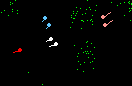
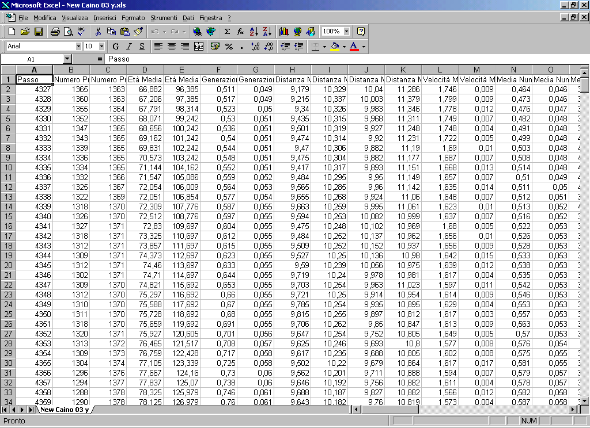
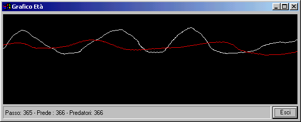
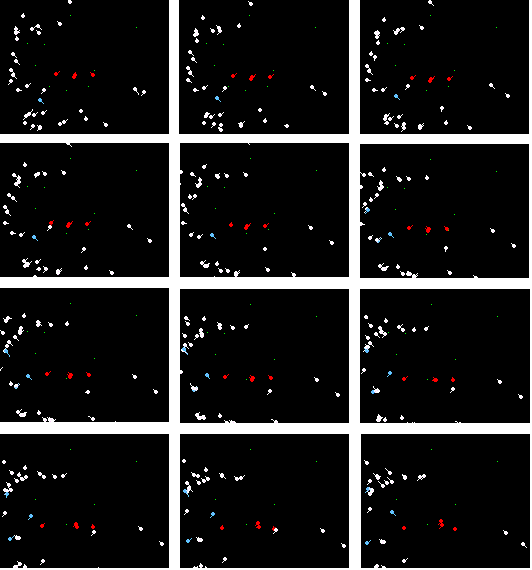

UNIVERSITÀ DEGLI STUDI DI MILANO

Facoltà di Scienze Matematiche, Fisiche e Naturali

Corso di Laurea in Scienze dell'Informazione

THE EMERGENCE OF COOPERATIVE BEHAVIORS IN THE SIMULATION OF
PREDATOR-PREY AGENT POPULATIONS

Supervisor: Prof. Giancarlo MAURI

Co-Supervisors: Dott. Stefania BANDINI

Prof. Ottavio D'ANTONA

> Student:

> Andrea Iacono

> Matr. n° 436750

Academic Year 1998/1999

## 

We are survival machines - robot vehicles blindly programmed

to preserve the selfish molecules known as genes

Richard Dawkins, The Selfish Gene, 1976

# Introduction

The purpose of this thesis is to demonstrate that simulations on the
interaction of artificial populations of prey and predators, when
properly configured, enable the spontaneous emergence of conspecific
cooperation. We chose to implement the simulation of agents through
neural networks, and their evolution was entrusted to genetic
algorithms. The neural network representing each artificial agent takes
as input part of the artificial world surrounding it and produces as
output where to move, whether to eat, and whether to reproduce. At the
beginning of the simulation, the neural network values are randomly
chosen, so what the agents do appears very chaotic. The genetic
algorithms used for agent evolution use the neural network weights as
genetic code---that is, the encoding of their behavior; when two agents
mate, their offspring's genetic heritage will consist of part of one
parent's code and part of the other's.

Consider a prey at the beginning of the simulation (thus with chaotic
behavior): if its neural network has as input the vision of a predator
in front of it, and as output makes the prey move in that same
direction, this prey will very likely have a rather short life and
therefore will be able to reproduce less and spread its genetic code
less; conversely, if the prey's neural network weights make it move in
the opposite direction when it sees a predator, then it is more likely
to live long enough to reproduce and thus spread a genetic heritage that
makes it flee when it sees a predator. This reasoning also works for
food and reproduction: the more one is attracted to them, the more
easily one can feed and reproduce. After a few generations, natural
selection exercised by the environment has already chosen the most
suitable agents: one can observe prey heading toward food and fleeing
from predators who, in turn, chase them and approach each other to
reproduce.

The cooperative aspect of this simulation appears only after many
generations. As biological observation teaches us, many animal species
live in groups, driven by the greater advantages of collective life
compared to those of isolated life. This means that over time, natural
selection has decreed as more suitable those animals of certain species
that tended to live in groups, since this behavior allowed them to
survive more. Compared to simulations present in the literature, which
study only the interaction between prey and predators, or only the
emergence of cooperative behaviors in a population, the purpose of this
thesis is to obtain aspects of cooperation between conspecific elements
in the simulation of an environment inhabited by prey and predators.

After many generations, the simulation achieves excellent results.
Cooperation manifests in both species: prey tend to stay in groups to be
able to reproduce, but when a predator approaches they scatter radially,
because by doing so each of the prey has the greatest probability of
saving itself, even though some will surely die. Predators also tend to
stay in groups and continue to do so even when attacking, so that each
of them has the greatest probability of feeding. By varying the
simulation parameters, very different results are obtained, as each of
the possible parameter configurations represents a distinct biological
reality with mechanisms that can favor cooperation, disfavor it, or,
more likely, lead to the extinction of one or both species.

The results achieved demonstrate that cooperation is indeed a
spontaneous phenomenon that emerges under certain environmental
conditions, given that cooperation was not coded in any way into the
elements of the artificial populations; it was evolution that decreed
that by cooperating one survives more easily. To reach these results,
the original structure of the simulation had to be changed considerably;
the fundamental factor thanks to which the results described above were
achieved consists in the enormous breadth of parameters that
characterizes both the elements and the environment itself, without
which it was not possible to describe an environment accurately enough
to obtain the emergence of cooperation between elements.

This thesis is structured in five chapters, each of which deals in depth
with some aspects of the simulation.

In the first chapter, the tools used for the structure of artificial
elements---neural networks---and for the evolution of the networks
themselves---genetic algorithms---will be examined in detail.

In the second chapter, the new discipline of artificial life will be
examined: its birth, its evolution, its results, and examples chosen
from among the most significant applications. A paragraph is dedicated
to the scientific approach to ecological problems in biology.

In the third chapter, the structure of the simulation will be thoroughly
described, including implementation choices, development methodology,
data structures, and in great depth the evolution undergone by the
simulation to achieve cooperation results.

In the fourth chapter, the functioning of the application will be
illustrated, along with the available tools and the interpretation of
output.

In the fifth and final chapter, the results obtained and the
developments of the application will be described, in addition to an
in-depth examination of the validity of simulations as a scientific
investigation tool.

# The Tools

## Neural Networks

### Historical Background

The modern vision of neural networks began thanks to the work of Warren
McCulloch and Walter Pitts published in the article "A logical calculus
of the ideas immanent in nervous activity" in 1943. Their thesis argued
that networks of artificial neurons could, in principle, compute any
arithmetic or logical function. The publication of this article is
unanimously considered the beginning of neural network studies.
McCulloch and Pitts were followed by Donald Hebb, who demonstrated that
classical conditioning (discovered by Pavlov some decades earlier) is
present due to the intrinsic properties of individual neurons; he also
proposed a model to explain learning in biological neurons.

Towards the end of the 1950s, Frank Rosenblatt and his colleagues
developed a class of neural networks called the perceptron and
demonstrated its ability to perform pattern matching. Shortly after,
Bernard Widrow and Ted Hoff introduced a new learning algorithm that
they used to train adaptive linear networks, similar in structure and
capability to Rosenblatt's perceptron. Unfortunately, both these models
suffered from the same limitations, widely publicized in "Perceptrons"
by Marvin Minsky and Seymour Papert in 1969, which hypothesized that
neural networks could not achieve better results. The publication of
this book was followed by a period of stagnation in which funding and
interest in neural networks declined dramatically.

Nevertheless, during the 1980s two fundamental results were obtained:
the first was the use of statistical mechanics to explain the
functioning of a particular class of recurrent networks that can be used
as associative memory. The second was the invention of the
backpropagation algorithm for training multilayer perceptron networks,
discovered by multiple researchers independently. These contributions
gave new life to neural network research, which has not suffered
slowdowns since then.

### Biological Inspiration

The brain is formed by approximately 10¹¹ elements, neurons, highly
connected to each other: each of them has about 10⁴ connections with
others. Regarding the biological aspects that interest us for simulating
an artificial neural network, the main elements to consider are three:
the neuronal cell, dendrites, and axons. Dendrites are receptive
ramifications of nerve fibers that carry electrical signals inside the
neuronal cell; the neuronal cell sums and controls all the signals that
arrive from the dendrites; the axon is a long nerve fiber that carries a
signal from the neuronal cell to other neurons. The contact point
between the axon of one cell and a dendrite is called a synapse.

The functioning scheme of a neuron provides that if the sum of all
impulses transmitted by dendrites to the cell exceeds a certain
threshold, the neuronal cell discharges its electrical signal onto the
axon, which will propagate to all dendrites of other neurons to which it
is connected.


Figure 1.1

Part of the neural structure is defined congenitally at birth, part is
developed through learning, creating new connections between neurons and
eliminating others. The neural structure changes continuously during
life; these successive changes consist mostly of strengthening or
weakening synaptic contacts between neurons.

Artificial neural networks, to date, cannot reach the complexity of our
brain, although there are two fundamental similarities: the building
blocks of both networks are very simple computational devices (actually
biological neurons are much more complex than artificial ones) highly
interconnected with each other; the connections between neurons
determine the function computed by the network. Despite biological
neurons being very slow (about 10⁻³ s) compared to electronic circuits
(about 10⁻⁹ s), our brain is capable of performing very complex
calculations faster than any existing digital computer today.

### The Artificial Neuron

Based on biological observations, McCulloch and Pitts proposed a simple
neuron model for which five assumptions are made that govern its way of
operating:

1.  It is a binary device (can be found in only two possible states)
2.  Each neuron has a fixed threshold
3.  It receives inputs from excitatory synapses associated with a weight
4.  It can also receive inputs from inhibitory synapses so that if one
    of them is active, the neuron cannot activate
5.  There is a finite time for input integration during which the neuron
    calculates its state

In a formal neuron, the state of excitation is represented by an
activation threshold expressed by a real number; the mechanism of
activation discharge along the axon is represented by a transfer
function that returns the neuron's output value; the synapse is called
weight, since the connection of two artificial neurons in close contact
with each other has a strong weight.

Taking inspiration from the actual functioning of the brain, an
artificial neuron was formalized composed of:

-   Inputs: represent dendrites
-   Outputs: represent the axon and its ramifications
-   Transfer function: represents the nucleus of the neuronal cell

The neuron's processing therefore consists of multiplying the weights
associated with each input by the respective input values and, after
summing them, checking if they exceed the neuron's activation threshold
value; if the threshold is exceeded, this value is used as a parameter
of the transfer function, which returns the artificial neuron's output.
Depending on the neuron's purpose, different transfer functions can be
used; Table 1.1 indicates the main ones:


| Transfer Type              | Function | Graph                      |
| --- | --- | --- |
| Linear|  T(x) = αx    |  |
| Ramp  | ```math
T(x) = { +y ⟷ x ≥ y
       { x ⟷ |x| < y
       { -y ⟷ x ≤ -y``` |  |
|Step      |  ```math
T(x) = { +g ⟷ x > 0
       { -d ⟷ x ≤ 0```  |  |
|   Boolean   |    ```math
T(x) = { 0 ⟷ x ≤ 0
       { g ⟷ x > 0```    |  |
|  Sigmoid    |   ```math
T(x) = 1/(1 + e^(-x))``` |  |
|  Hperbolic Tangent    |    ```math
T(x) = tanh(x)```        |  |


Table 1.1 -- Transfer functions for artificial neuron output

Figure 1.2 represents a formalization of an artificial neuron with three
inputs: weights *w*~*i1\ *~*,w*~*i2\ *~and* w*~*i3*~* * are multiplied
by the inputs and summed within the neuron; if this value exceeds the
neuron's threshold value **~*i*\ ~, it is used as a parameter of the
step transformation function (as indicated by the symbol inside the
circle), which returns the neuron's output value *x*~*i*~.


Figure 1.2


### Artificial Neural Networks

Typically, a single neuron, even with many inputs, may not be sufficient
for all purposes; most complex problems need multiple artificial neurons
operating in parallel in a structure called a layer. A single-layer
artificial neural network is composed of a set of neurons whose inputs
are shared among them; it should be noted that each individual neuron
associates a weight to an input that is not linked to that of other
neurons. Each layer therefore has a set of inputs, directed to all
neurons, and a set of outputs, formed by the union of all outputs of
individual neurons; this type of configuration provides that none of the
outputs can be an input for another neuron, as illustrated in Figure
1.3.


Figure 1.3


Such a network may still not be sufficient to solve many problems; for
this purpose, a certain number of single-layer neural networks can be
connected together: a multilayer neural network consists of a set of
interconnected single-layer networks; the problem's input represents
the inputs for the first layer of the network; the output of one network
layer represents the input for the next layer; the output of the last
layer determines the output of the entire neural network. Artificial
neurons that receive signals from outside are called input units of the
network; neurons that provide their output value to the external
environment are called output units of the network. Figure 1.4
represents a fully interconnected neural network formed by three levels.


Figure 1.4

Thanks to layer stratification, it is possible to make a network perform
very complex task calculations; typical examples of this type of network
are voice and optical recognition.

### Learning

It is typical of biological neural networks to learn through examples
and subsequently generalize the learned notions. To obtain the same
behavior in an artificial neural network, one can proceed in various
ways. Learning can be of two types:

-   **Supervised**: in the case where, during the learning phase, the
    neural network is provided, in addition to the input, also with the
    desired output based on which errors are derived or at least
    information about the correctness of the result;
-   **Unsupervised**: in the case where only examples are provided to
    the network and it is expected to discover correlations on its own
    and organize itself accordingly autonomously.

A network's output is a function of inputs and weights of connections
between individual units: these connections must therefore be acted upon
to ensure that the network's response is correct. In the case of
supervised learning, following an iterative procedure, one tends to
"reward" connections that tend to provide the correct answer and
"correct" others so that progressively the solution tends toward the
correct one. In the unsupervised case, the concepts of "correct" and
"wrong" do not exist and connections are modified so that similar
inputs correspond to similar outputs. The sequence of events can be
schematized in three points:

1.  The neural network is stimulated by the environment.
2.  As a result of stimulation, certain changes occur in the network.
3.  Due to these modifications to its internal structure, the network
    reacts to the environment in a new way.

It is important to note that the better or worse quality of learning
should be judged considering not so much the network's ability to give
correct answers to example problems, but rather in knowing how to
extrapolate from these a more general rule that puts the network in a
position to give the right answer even to new problems of the same class
and, at least in principle, "never seen".

## Genetic Algorithms

### Introduction

In the 1950s and 1960s, several computer scientists studied evolutionary
systems independently of each other with the idea that evolution
mechanisms could be used as optimization tools for engineering problems.
The basic idea of all these systems consisted of evolving a population
of candidate solutions for a given problem using operators inspired by
natural genetic variability and natural selection. Genetic algorithms
were invented by John Holland in the 1960s and were developed by Holland
himself and his students and colleagues at the University of Michigan in
subsequent years. Unlike evolutionary strategies and evolutionary
programming, Holland's original purpose was not to design algorithms to
solve specific problems, but rather to formally study the phenomenon of
adaptation as it occurs in nature and to invent techniques to transfer
natural adaptation mechanisms within computer systems. Holland's 1975
book, "Adaptation in Natural and Artificial Systems," presented the
genetic algorithm as an abstraction of biological evolution and provided
a theoretical framework for the notion of adaptation in the context of
evolutionary programming. Holland's algorithm is a method to move from
a population of "chromosomes" (for example strings of ones and zeros,
or "bits") to a new population using a kind of "natural selection,"
along with crossover, mutation, and inversion operators that take
inspiration from genetic laws. Each chromosome is made of "genes" (for
example bits), each representing an instance of a particular "allele"
(for example 0 or 1). The selection operator chooses from the population
those chromosomes that will have the opportunity to reproduce, and on
average the fittest chromosomes will produce more offspring than the
less fit ones. Crossover exchanges parts of chromosomes, imitating more
or less biological recombination between two organisms with a single
chromosome (haploids); mutation randomly modifies allele values in some
chromosome positions; and inversion changes the order of a chromosome
section, therefore changing the order in which genes are arranged (here,
as in most genetic algorithm literature, "crossover" and
"recombination" have the same meaning).

Holland's introduction of a population-based algorithm with crossovers,
inversions, and mutations was a major innovation (evolutionary
strategies started with a "population" of two individuals, a parent
and an offspring, which was a mutated version of the parent; populations
with many individuals and crossovers were included only later; other
currents used only mutation to introduce variations). Furthermore,
Holland was the first to try to found evolutionary computation on a
solid theoretical basis. Until a few years ago, this theoretical
foundation, based on the notion of "schema," was the starting point
for almost all subsequent theoretical work on genetic algorithms.

### Basic Elements of Genetic Algorithms

There is no rigorous definition of "genetic algorithm" accepted by all
members of the scientific community that allows them to be clearly
distinguished from other evolutionary computation methods. In any case,
it can be said that most methods called "genetic algorithms" have at
least the following elements in common: a population of chromosomes,
selection that acts based on fitness, crossover to produce new
offspring, and random mutation of these. Inversion - the fourth element
of Holland's theorization - is rarely employed in today's
implementations, and its advantages, if there really are any, have never
been well defined.

Chromosomes in a genetic algorithm's population are generally
represented by bit strings. Each locus in a chromosome has two possible
alleles: 0 and 1. Each chromosome can be thought of as a point in the
search space of candidate solutions. The algorithm manipulates
chromosome populations, successively replacing one of these populations
with another; a fitness function is also necessary that assigns a score,
or fitness, to each chromosome in the current population. The
chromosome's fitness depends on how well it solves the problem being
addressed.

The simplest form of genetic algorithm requires three types of
operators: selection, crossover, mutation:

-   **Selection or fitness**: this operator selects chromosomes destined
    for reproduction. The higher the chromosome's fitness, the more
    frequently it will be chosen for reproduction.
-   **Crossover**: this operator randomly chooses a locus and exchanges
    between two chromosomes the subsequences that precede and follow
    this locus to create two offspring. For example, strings 10000100
    and 11111111 could be crossed from the third locus onward to
    generate two offspring 10011111 and 11100100. The crossover operator
    roughly imitates biological recombination between two organisms with
    a single chromosome (haploids).
-   **Mutation**: this operator changes the value of some bits in the
    chromosome. For example, string 00000100 could be mutated in the
    second position to obtain 00100100. Mutation can occur in any
    position of the string with a certain probability, usually very low
    (for example 0.001).

Figure 1.5 illustrates crossover and mutation operators on a string of
bits 0 and 1:


Figure 1.5


### Associated Use of Genetic Algorithms and Neural Networks

The genetic algorithms seen in previous paragraphs can evolve almost any
computer structure, provided it is sensibly encoded as a genome. Even
the neural networks seen in the first paragraph do not escape this
principle, and in fact are one of the most promising applications of
genetic algorithms in the field of artificial life.

It is possible to apply genetic algorithms to neural networks in many
different ways. Some aspects that can be evolved are weights in a
network of fixed architecture, the network's architecture (that is, the
number of units and their interconnections can change), and the learning
rule used by the network. In this paragraph, two different examples will
be given, the first of which uses a genetic algorithm to evolve the
weights of a fixed network, while the second uses genetic algorithms to
evolve a neural network's architecture.

David Montana and Lawrence Davis (1989) chose the first approach -
evolution of weights in a fixed network. More precisely, they used the
genetic algorithm instead of backpropagation to find a good set of
weights for a predetermined set of connections. Various problems
associated with the backpropagation algorithm (namely, the tendency to
get stuck on local optima in weight space, or the lack of a "teacher"
capable of supervising learning for certain tasks) often make the
discovery of alternative schemes for weight determination desirable.

Montana and Davis were interested in using neural networks for
classifying underwater sound *lofargrams* (similar to spectrograms) into
two classes: interesting and uninteresting. The final objective was to
identify and analyze interesting signals by extracting them from the
great variety of acoustic noise and interference present in the ocean.
The networks would have to be trained using a database containing
lofargrams and classifications made by experts to decide whether a given
lofargram was interesting or not. Each network had four input units,
representative of the four parameters used by an expert system that
performed the same classification, one output unit, and two layers of
hidden units (the first with seven units, the second with ten). The
networks were unidirectional layered propagation and fully connected -
that is, each unit was connected to all units of the immediately
superior layer. There were therefore 108 weighted connections between
units, plus 18 weighted connections between non-input units and a
"threshold unit" whose output connections implemented threshold values
for each of the non-input units, for a total of 126 weights to evolve.


Figura 1.6

The genetic algorithm was used in this way. Each chromosome was a list
(or vector) of 126 weights. Figure 1.6 shows (for a much smaller
network) how encoding was realized: weights were read from the network
in a fixed order (left to right, top to bottom) and put in a list. Note
that each "gene" of the chromosome is not a bit but a real number. To
calculate the fitness of a given chromosome, the chromosome's weights
were assigned to the corresponding network's connections, the network
was applied to the training set (in this case 236 examples taken from
the lofargram database), and the sum of squared errors (calculated over
all training cycles) was provided as a result. In this context, error
was the difference between the desired output activation value and the
obtained one. A small error corresponded to high fitness. An initial
population of 50 weight vectors was randomly chosen, with each weight
between -1.0 and +1.0. Montana and Davis tried a large number of
different genetic operators during various experiments. The mutation and
crossover operators they employed for comparison between the genetic
algorithm and backpropagation are illustrated by Figures 1.7 and 1.8:


Figure 1.7


Figure 1.8

The mutation operator chooses *n* non-input units and
adds to the weight of each input connection to those units a random
value between -1.0 and 1.0. The crossover operator takes two parent
weight vectors and, for each non-input unit of the offspring vector,
randomly chooses a parent and copies the corresponding connection
weights from parent to offspring. Note that only one offspring is
created.

Montana and Davis compared the performance of a genetic algorithm using
these operators with those of a backpropagation algorithm. The genetic
algorithm had a population of 50 weight vectors, employed a selection
method based on relative fitness, and was run for 200 generations
(corresponding to 10,000 network evaluations). The backpropagation
algorithm was instead run for 5,000 iterations, where an iteration is an
entire epoch (a complete cycle through the training data). Montana and
Davis argued that two network evaluations by the genetic algorithm are
equivalent to one backpropagation iteration, since backpropagation for a
given training example consists of two parts - forward propagation of
the activation signal (and calculation of errors on output units) and
backward error propagation (and weight adjustment). The genetic
algorithm performs only the first part. Since the second part requires
more calculations, two evaluations by the genetic algorithm require less
than half the calculations of a single backpropagation algorithm
iteration.


Figure 1.9

The comparison results are presented in Figure 1.9. In
this graph, one backpropagation algorithm iteration is indicated for
every two genetic algorithm iterations. The x-axis indicates the number
of iterations, and the y-axis indicates the best evaluation (minimum sum
of squared errors) discovered up to that point. It can be seen that the
genetic algorithm's performance is decidedly superior to that of
backpropagation, in the sense that it achieves better weight vectors
faster.

This experiment demonstrates that in some situations the genetic
algorithm is a better training method for networks than simple
backpropagation. This does not mean that the genetic algorithm performs
better than the backpropagation algorithm in every circumstance.
Improvements could perhaps be made to the backpropagation algorithm that
would allow it to overcome some of the problems that prevented it from
achieving the same results as the genetic algorithm in this experiment.
Schaffer, Whitley, and Eshelman (1992) point out that the genetic
algorithm failed to surpass the performance of the best weight update
methods (for example, "quickprop") in the case of supervised learning
tasks, but predict that the genetic algorithm will prove very useful in
searching for weights to perform tasks for which backpropagation and its
variants cannot be applied, such as unsupervised learning tasks, where
output unit error is not known to the learning system, or in situations
where only sporadic reinforcement is available. This often happens in
neural control tasks, where neural networks are used to control complex
systems like robots that must orient themselves in unknown environments.

Montana and Davis's genetic algorithm evolved weights in the context of
a fixed network. As happens in most neural network applications, the
network architecture - the number of units and their interconnections -
is established in advance by the programmer guided by intuition, often
assisted by heuristic techniques (for example, the famous principle in
the field that "difficult problems require more hidden units") and
experience. Neural network researchers know all too well that the
particular architecture chosen can determine the success or failure of
the application, so they would be very happy to be able to automatically
optimize the architecture design procedure for a particular application.
Many believe that genetic algorithms are up to this task. Many efforts
have been made toward this goal, efforts that fall mostly into one of
these two categories: direct encoding and grammatical encoding. In the
case of direct encoding, network architectures are directly encoded by
genetic algorithm chromosomes. In the case of grammatical encoding, the
genetic algorithm does not evolve network architectures; it instead
evolves a grammar that can be used to develop network architectures.

The direct encoding method was used in the work of Geoffrey Miller,
Peter Todd, and Shailesh Hedge (1989), who limited their initial project
to unidirectional propagation networks with a fixed number of units for
which the genetic algorithm would have to evolve the connection
topology. As indicated in Figure 1.10, the connection topology is
represented by an N^N matrix (5*x^5 in the figure) where each element
encodes the type of connection from the source unit to the destination
unit. Matrix elements could be "0" (indicating no connection) or "A"
(indicating a connection capable of "Learning" - that is, a connection
whose weight can vary through learning). Figure 1.10 also shows how the
connectivity matrix was transformed into a chromosome suitable for the
genetic algorithm ("0" corresponds to 0 and "A" to 1) and how the
bit string translated into a network. Connections indicated as capable
of learning were initialized with low random weights. Since Miller,
Todd, and Hedge limited themselves to unidirectional propagation
networks, all direct connections to the input unit or backward
connections specified in the chromosome were ignored.


Miller, Todd, and Hedge employed a simple selection method proportional
to fitness and mutation (bit string values had a certain low probability
of being changed). Their crossover operator randomly chose a row index
and exchanged corresponding rows between two parents to create two
offspring. Behind the choice of this operator was the same intuition as
Montana and Davis's operator - each row represented all incoming
connections to a certain unit, and this set was thought to be a
functional component of the network. A chromosome's fitness was
calculated as in Montana and Davis's project: for a given problem, the
network was trained for a certain number of epochs on a training set,
using backpropagation to modify weights. The chromosome's fitness was
the sum of squared errors on the training set of the last epoch. Here
too, low error translated to high fitness.

Miller, Todd, and Hedge tested their genetic algorithm on three tasks:

-   **XOR**: The single output unit present should turn on (that is, its
    activation should be above a given threshold) when the exclusive or
    between initial values (1 = on, 0 = off) of the two input units
    is 1.
-   **Four quadrants**: Real-valued activations (between 0.0 and 1.0) of
    the two input units represent coordinates of a point in the unit
    radius square. All inputs representing points belonging to upper
    right and lower left quadrants should produce 0.0 activation on the
    single output unit present, and all other points should produce 1.0
    output activation.
-   **Encoding/Decoding (Pattern transcription)**: output units
    (numerically equal to input ones) should reproduce the initial state
    of input units. This would be trivial if not for the fact that the
    number of hidden units is less than the number of input units, so
    encoding and decoding work is necessary.

It is relatively simple for a unidirectional propagation neural network
to learn to solve all these problems using backpropagation. Networks had
different numbers of units depending on the task (from 5 units for the
XOR task up to 20 units for the encoding/decoding task); the objective
was to verify whether the genetic algorithm could discover good
connection topology for each task. For each execution, population size
was 50, crossover probability was 0.6, and mutation probability was
0.005. In all three cases, the genetic algorithm easily managed to find
networks capable of readily learning to calculate outputs from inputs,
taken from the training set, with few errors. However, the three tasks
were too simple to constitute rigorous proof of this method's
validity - it remains to be seen whether it can adapt to more complex
problems requiring much larger networks with more interconnections.

# Artificial Life

## Introduction

When NASA organized the Viking Lander mission to Mars, one of the most
controversial problems that scientists faced was developing and agreeing
upon tests to identify the presence of life on the red planet. A large
number of instruments were loaded onto the spacecraft in the hope of
detecting even the smallest signs of viral life: growth, food
consumption, and waste production. Despite every attempt at biological
impartiality, these tests suffered from a strong terrestrial bias:
assumptions about what Martian microbes would eat, "breathe," or live
in were dictated by our biochemical preferences for carbon and water.
Ultimately, the Viking probe obtained no data for or against the
presence of life on Mars.

Whether conducted with space probes or radio telescopes, our search for
life forms on Mars or anywhere in the universe carries with it precise
assumptions about the very nature of life. Is life based on carbon
compound chemistry---the only kind we can observe on planet Earth---the
only possible kind? Is multicellular life inevitable? Does intelligence
necessarily imply the development of a technological civilization like
ours? Is life rarely found in the universe or, conversely, is it very
widespread? If we didn't receive a clearly coded radio signal from
benevolent aliens, and instead had to perform long and patient
exploration of the cosmos, how would we recognize the presence of life?
Because ultimately, what is life really? This last question cannot have
a definitive answer due to our limitations as inhabitants of Earth:
without other life forms to observe and compare to those we know, we are
unable to characterize life in general.

A possible solution may come from the apparently distant world of
computer science, specifically from experiments in that new branch of
artificial intelligence known as artificial life, which deals with the
study of human-constructed systems that manifest behaviors typical of
life. The surprising results of this discipline suggest that life is a
dynamic process, independent of its material foundations, that emerges
from the complex flow and interaction of information. The goal of
artificial life is to achieve through computers the spectacular
complexity and diversity of biological life, using the same principles
that govern natural life.

## Historical Background

Can a machine reproduce? Can software evolve? How can sophisticated
robots be built that act in a "human" environment? Can an ecosystem be
reconstructed in a computer? How can flocks of birds fly uniformly?

These are some of the research themes that artificial life scientists
confront.

The question "Can a machine reproduce?" was posed by mathematician
John von Neumann in the early 1950s and was investigated before his
sudden death in 1957. Specifically, John von Neumann wondered whether an
artificial machine could create a copy of itself, which could then
reproduce in turn and multiply infinitely, in analogy with living
beings. Von Neumann wanted to study the logic necessary for
reproduction. He was not interested in, nor did he have the appropriate
tools to build, such a machine of biochemical or genetic type. Remember
that the discovery of the DNA double helix by Watson and Crick occurred
only a few years later. To conduct such a study, John von Neumann used a
model conceived by his colleague, mathematician Stanislaw Ulam. The
model, called Cellular Automaton (CA), consists of a large grid of
cells, similar to a checkerboard, each of which possesses a certain
color dependent on a specific state. All cells change state
simultaneously such that the color of any cell at a given instant
depends exclusively on its own color and the color of immediately
adjacent cells (above, below, right and left) in the previous instant.
The principle guiding the color changes is the same for all cells and is
known as the "transition rule." For example, a simple rule for a
two-color automaton (white and black) sets a cell's color for the next
instant to black if it has a greater number of black neighbors, and vice
versa. A machine, in the cellular automata model, is a collection of
cells that can be considered operating in unison. For example, if there
exists a configuration of cells that seems to move one cell to the right
at each time step, then we say that such a configuration behaves like a
machine that moves to the right. Von Neumann used this simple model to
describe a universal constructor machine, which can read assembly
instructions for any machine and build that machine following these
instructions. Such instructions are a collection of cells of different
colors, exactly like the new machine once assembled; in fact, every
element composed on the grid is nothing but a collection of cells. Von
Neumann's universal constructor can build any machine once given the
appropriate instructions. If such instructions were those for building a
copy of the same universal constructor, then the machine would build a
copy of itself and thus reproduce. If we wanted the copy to then
reproduce in turn, we would have to provide the assembly instructions to
the machine by copying them to it. In this way, von Neumann showed that
a reproductive process is possible for artificial machines. The actual
demonstration is very elaborate and was published posthumously by a
colleague of von Neumann, Arthur Burks. A much simpler structure that
demonstrated self-replication functions (although without universal
construction capability) was proposed by computer scientist Chris
Langton more than three decades later. One of von Neumann's main
conclusions was that the reproductive process uses assembly instructions
in two distinct ways: both as instructions interpreted and executed for
assembly, and as data to be copied and transferred to offspring. During
the following decade, investigations into natural genetic processes
began to make their first progress, and it was discovered that nature
uses the same method. The process by which instructions (DNA) are used
to construct machines (proteins) makes dual use of information: both as
code and as data. In biology, the first process is called translation,
the second transcription. This description demonstrates the basic
approach of artificial life. This field welcomes researchers from
different disciplines such as computer science, physics, biology,
chemistry, economics, philosophy, and others. Artificial life, as
defined by Chris Langton, one of its founders, is a field of study that
aims to understand life by trying to abstract the fundamental principles
and dynamics that distinguish the biological phenomenon and recreate
these dynamics in different contexts and environments, such as
computers, making them accessible to new types of experimental
manipulations. While biological research is essentially analytical and
seeks to decompose complex phenomena into their fundamental components,
artificial life is synthetic and seeks to reconstruct phenomena starting
from their fundamental units. As such, this discipline is complementary
to traditional biological research thanks to the possibility of
exploring new paths in the mission to understand the great enigma of
life. The term "artificial" means that the system in question is
created by humans, that is, the fundamental components were not created
by nature through evolution. However, the high-level phenomena that
arise from them are totally genuine. The reproductive process introduced
for machines by von Neumann is truthful when compared with the real one.
The difference is exclusively in the basic components: artificial cells
instead of living cells. However, the fact that truthful phenomena are
observable from simulation results serves as the foundation for
artificial life research. The basic assumption consists in the fact that
life is not necessarily based on carbon compound chemistry but can also
exist in different elements. As argued by Langton, in addition to
providing new means for studying biological phenomena associated with
life on earth, so-called life-as-we-know-it, artificial life allows us
to extend our studies to the broader domain of biology of every possible
form of life, so-called life-as-it-could-be.

Until the 1980s, it can be said that the only research thread on
Artificial Life was precisely that on cellular automata. Precisely to
unify efforts and take stock of the situation, the first conference on
artificial life was held in Santa Fe in September 1987 (which is
considered the official birth act of this new science), organized by
Chris Langton of the Santa Fe Institute. Not only scientists who, with
various approaches, worked on robot construction, or cognitive
scientists participated, but also philosophers, chemists, and
biologists. Subsequently, attempts were made to better define the
competencies of this discipline and to formalize its boundaries and
scope. Other conferences were held in the United States and Europe, in
addition to increasingly frequent publications.

## Evolution and Emergence in Artificial Life

The topics addressed by artificial life researchers concern both
biological phenomena and complex systems in general. Therefore,
artificial life pursues a double objective: increasing our understanding
of nature and increasing our understanding of artificial models, thus
providing us with means to increase their performance. An example of the
first objective is von Neumann's research described earlier, while an
example of the second objective is the work of John Koza (described
later) on software that develops through evolution. Computer programs
are currently written by human beings: programmers. During recent years,
we have witnessed the increase in software complexity as the tasks
assigned to machines have grown increasingly in size and complexity. The
increase in computational capabilities has increased our desire for more
complicated applications, in some cases very evidently as, for example,
with the assault on areas of artificial intelligence and neural
networks.

Koza's method, known as genetic programming, is based on John
Holland's research on genetic algorithms from the 1970s and 1980s,
already addressed in the previous chapter.

While a programmer develops a single program, attempting to perfect it
as much as possible, genetic programming involves a population of
programs. The initial population, called the first generation, consists
of randomly generated programs. Subsequent generations are generated by
the evolutionary process, so that over time the population is composed
of increasingly better, more adapted programs. Each generation is
created by applying genetic operators to the programs of the previous
generation.

One of the main arguments that must be discussed is what constitutes a
good program. This question, while being very complex in nature, has a
much simpler answer in the context of genetic programming. Fitness is
identified by the programmer, in accordance with the particular problem
under examination. For example, if we seek a program that manages the
movements of a robot arm that can stack some blocks in a specific order,
the program's fitness measures the quality of a particular order in
which the blocks have been arranged. Note that the evolutionary process
develops without external intervention from the programmer. After the
objective has been formalized, a population is created randomly (not
entirely randomly, since some parameters are fixed based on the type of
problem we are analyzing) and evolution proceeds until a satisfactory
solution is found. An evolutionary method is advantageous not only
because it manages to solve complex problems but also because it offers
greater flexibility. Currently existing computer programs are known for
their rigidity; if an unforeseen event occurs, a block or error occurs.
This aspect is one of the main causes of the high cost of software
development and maintenance. However, evolution offers the possibility
of adaptation to a dynamic environment: should an unexpected event
occur, the system could evolve, that is, adapt to the new situation in
analogy with the natural mechanism.

Evolution is one of the central aspects of artificial life research. One
of the major problems still open is the origin of life: how did the
first organism capable of reproducing appear? This event is considered
the precursor to evolution, which led to the development of the immense
variety of species present on earth today. Von Neumann approached the
logic of reproduction more than 40 years ago, demonstrating its possible
relationship with machines not based on carbon compound chemistry. The
essential conditions for self-reproduction in nature are the subject of
intense studies nowadays. Artificial life can help in this research by
exploring new paths, as a useful complement to those of traditional
biology.

Another predominant aspect of artificial life systems is that of
emergence, where phenomena develop at a given level triggered by
interactions between elements of underlying levels. In physical systems,
temperature and pressure are examples of emergent phenomena: they are
present, for example, in large masses of molecules and are due to their
interactions at the molecular level. But a single molecule taken alone
has neither temperature nor pressure, which are higher-level and
emergent phenomena. Artificial life systems are composed of a large
collection of simple basic elements, whose interesting characteristics
are those that emerge at higher levels.

This differs completely from the scientific investigation methodology
initiated by Galileo; in traditional research, investigation succeeds
because the system being studied is a linear system, in which the
behavior of the whole corresponds to the sum of the behaviors of the
individual parts. Linear systems, that is, follow what is defined as the
"superposition principle," according to which it is possible to study
a system, even a complex one, by dividing it into parts, and once these
are studied and understood, it is sufficient to recompose them to
understand the functioning of the system in its totality.

There exist, however, certain systems, defined as non-linear, that do
not obey the superposition principle. Even studying individual
components, it is not possible to arrive at a complete understanding of
the total system. The problem with non-linear systems is that the
factors that most contribute to generating global behavior are the
properties of interactions between parts, and not the properties of the
parts themselves. And every interaction is necessarily missing when
pieces are isolated for analysis.

As an investigation method, therefore, analysis proves to be extremely
powerful when dealing with problems derived from linear systems, but
when dealing with non-linear systems that must be studied as a single
whole, it is no longer sufficient and another type of approach must be
chosen. A possible solution is to abandon analysis and embrace
synthesis: instead of starting from behavior to break it down into its
constituents, we can instead start from constituents and try to obtain
the behavior that interests us.

An example of a non-linear system is von Neumann's model that we have
already seen, where the fundamental elements are cells of a grid and the
observed phenomena concern objects composed of sets of various cells
(for example, the universal constructor machine).

Another example is Craig Reynolds' work on the behavior of bird flocks.
Reynolds wanted to study how flocks flew without the presence of a
central element (i.e., a pack leader). He created a virtual bird with
elementary flying capabilities and called it a "boid." The virtual
world was populated by a set of such boids that flew in accordance with
the following rules:

-   Avoid collisions with the nearest flockmates
-   Attempt to match velocity with nearest flockmates
-   Attempt to stay close to companions

Each boid comprises a unit that "sees" only its nearest companions and
flies in accordance with the three rules. These three rules were a
sufficient basis for the emergence of flocking behavior. The boids flew
as a compact group and when obstacles were present on their path, they
spontaneously divided into two subgroups, without any central guidance,
reuniting after overcoming the obstacle. The boids algorithm was later
used to produce realistic scenic effects of bat swarms for special
effects production in the films "Batman Returns" and "Cliffhanger."
Reynolds' model demonstrates the basic architecture of artificial life
systems: a large number of relatively simple elementary units that
interact with a small number of nearby companions without any central
control. High-level emergent phenomena resulting from these low-level
interactions are observable. Although Reynolds' boids are artificial,
the flocking behavior is identical to that observed in nature (this
point had also been noted for von Neumann's reproductive process
mentioned earlier). The principles of artificial life constitute the
heart of Reynolds' work. During the last decade, he has been involved
in building robots that can function in a human environment (with noise,
imperfect information), for example, that could traverse a building to
collect garbage. The robots possess minds consisting of a hierarchy of
layers, each dedicated to accomplishing more complex functions than the
one below. The lowest level deals with avoiding collision with
obstacles, the second is responsible for movement, that is, wandering
randomly through the environment. The second level does not worry about
avoiding obstacles, since that is handled by the one below. Higher
levels can subsume the role of lower levels by suppressing their output
signals, however, lower levels continue to function even with the
addition of additional layers. This method, called subsumption
architecture, generically describes human minds in which primitive
layers manage elementary functions (for example, breathing) and higher
layers deal with more complex functions (for example, abstract
thinking). Brooks' scheme allows the construction of robots
incrementally through the addition of functional layers, thus permitting
a sort of robotic evolution. Each layer consists of a behavioral module
that communicates asynchronously without the presence of central
control. For example, the first layer includes sensor and movement
modules. The operation of the system recalls the approach that Marvin
Minsky outlines in his book "The Society of Mind." He describes the
operations of the mind in terms of a set of agents, each responsible for
a simple function. Agents communicate with each other to reach a
decision, and the total emergent effect is an operative mind. Brooks
imagines a future when robots will help us in daily life, for example
with a waiter robot. Brooks' method for constructing sophisticated
robots demonstrates the artificial life approach, which is fundamentally
different from that of traditional artificial intelligence; this adopts
a top-down methodology where complex behaviors are highlighted (for
example, playing chess) and the effort lies in building a system that
represents all the details of the indicated behavior. Artificial life
operates with a bottom-up approach, starting from individual elementary
units, gradually building its way through evolution, emergence, and
development. Another difference between artificial intelligence and
artificial life consists in the pursued objectives. While the former has
traditionally engaged with complex human functions such as understanding
written text, medical diagnosis, etc., artificial life concentrates on
elementary natural behaviors, emphasizing survival in complex
environments. According to Brooks, an examination of the evolution of
life on earth shows that most time was spent developing elementary
intelligence. The elementary faculties developed allowed mobility in a
dynamic environment and sensory capabilities on immediate surroundings,
at a level sufficient to achieve life maintenance and reproduction. The
topics addressed by artificial intelligence appear only very recently on
the evolutionary scene (a few hundred years), and predominantly in human
beings. This suggests that problem solving, language, expert knowledge,
and reasoning are relatively simple once sustenance and reaction
capabilities are available. This idea is expressed in the title of one
of Brooks' publications: "Elephants Don't Play Chess," suggesting
that nevertheless these animals are very intelligent and perfectly
capable of surviving and reproducing in a complex and dynamic
environment.

The topic of evolution in nature has received the greatest attention in
the last twenty years. Darwin's fundamental theory, although still
complete today, needs deepening. For example, a well-known principle is
that of natural selection, usually considered to be an omnipotent force
capable of shaping organisms into perfect creatures. Stuart Kauffman's
work has revealed that other factors can influence evolution beyond
natural selection. He demonstrates that some complex systems tend to
self-organize, that is, that order can manifest spontaneously. A more
important conclusion is that this order can limit evolution to the point
that natural selection can no longer run its course.

Another principle of Darwin's theory is that of gradualism. Small
phenotypic changes would slowly accumulate in species. Paleontological
discoveries have revealed over the years a different perspective: long
periods of relative phenotypic stasis alternated with brief periods of
very rapid changes. This phenomenon has been dubbed "punctuated
equilibrium" by biologist Stephen Jay Gould. Although no complete
explanation yet exists, the phenomenon has recently been observed in a
large number of artificial life works, suggesting that it may be an
intrinsic aspect of some evolutionary systems.

Artificial life offers opportunities to conduct experiments that are
extremely complex for traditional biology, or even unsustainable.
Artificial life includes biological research, bringing the possibility
of cooperations that can lead to new scientific discoveries; moreover,
it manifests high potential for the development of new technologies:
software evolution, sophisticated robots, monitoring tools for
ecosystems, educational tools, and so on. This exciting discipline
combines aspects of both scientific speculation and applied research,
and has already produced very promising results for a brilliant future.

## The Scientific Approach to Ecology

### Introduction

In the last century and a half, biology has undergone a radical change
in its methods of investigating life. From simple cataloging of
different species, it has moved to scientific and systematic study of
life forms present on the planet and their interaction, using the
universal language of mathematics, instead of a purely descriptive
language like natural language. An important part of this process is due
to a branch of biology, ecology. Although this term is commonly misused,
its scientific meaning differs considerably from the value we are
accustomed to attributing to it. The definition most accepted by the
international community is that of Krebs, given in 1972: "Ecology is
the scientific study of interactions that determine the distribution and
abundance of living organisms." We are therefore very far from the
totalizing meaning that the media usually give it. For example, ecology
is not interested in atmospheric pollution, except insofar as it affects
the functioning mechanisms of natural systems.

Traditionally, ecology is divided into plant and animal ecology, due to
the historical division between botanists and zoologists; this division
is theoretically incorrect, because most ecosystems are organic sets of
animals and plants linked by mutual interactions. However, it must be
recognized that the study and research methodologies of the two fields
are completely different: plants are immobile while animals move and
have on average a greater variety of roles (herbivores, carnivores,
parasites). This explains why historically plant ecology has focused on
the study of species associations, while animal ecology has found its
fulcrum in population dynamics.

### Population Ecology

The term population means a set of organisms of the same species that
are part of a well-defined ecosystem. The main characteristic consists
in the fact that the various individuals that compose a population,
while being distinct from each other, behave together as a unit; these
units constitute the lowest level of ecological study. Population
ecology is the science that studies how and why one or more populations
change their characteristics over time and space. Some of the most
important variables used in this field are the numerical size of a
population, the age distribution of a population (i.e., the numbers or
percentages of individuals that make up each age class) and spatial
dispersion or population density (i.e., how the population is
distributed at each point in the ecosystem). The factors that cause
changes in these variables are essentially four: natality, mortality,
immigration, and emigration. Natality and immigration naturally have the
effect of increasing the population, while mortality and emigration have
the effect of depressing it. Population dynamics aims to focus on the
various ways in which these factors influence the state of a population
over time and the mechanisms of dependence of the same factors on the
population itself and on the environment that surrounds it.

The first scientific study on populations is the "Essay on Population"
written by Malthus in 1798; the thesis on which the book is founded is
that populations have within themselves the capacity to grow
exponentially, or if preferred, geometrically; this type of growth has
taken the name of Malthusian growth. Today we know that very many
populations do not grow at all in this way, but rather that this type of
growth occurs only if the environment in which the population develops
is constant and such as to guarantee each individual always the same
availability of resources, regardless of the number of individuals. This
means that a rich environment, as long as the number of individuals is
not excessive, allows Malthusian-type growth. In fact, each individual
cannot consume more than a certain maximum quantity of available
resources and therefore, as long as the product of the maximum quantity
times the population size does not exceed the total quantity of
resources present in the environment, each organism has available a
constant ration equal to its maximum quantity. There are two other
conditions for Malthusian growth to occur; the first is that the
population must be isolated, that is, there must be neither immigration
nor emigration; the second condition is that direct reciprocal harm of
population individuals can be excluded through, for example, aggressive
acts; in this case, the probability that attacks against an individual
would be triggered, thus decreasing their survival and reproduction
capacity, would obviously be increasing as population density increases.

### The Predator-Prey Model

The first coherent and quantitative theory of the predation phenomenon
is due to the work of two founding fathers of modern ecology: American
biophysicist Alfred J. Lotka and Italian mathematician Vito Volterra.
They, independently, arrived around the mid-1920s at formulating a
mathematical model that would describe the dynamics of a species of prey
and one of predators mutually coupled. The equations, now known by the
name Lotka-Volterra, are based on the assumption that both populations,
where they are isolated from each other, have Malthusian-type dynamics.
The prey has a positive intrinsic growth rate, while the predator, being
excluded from its food, can only die of starvation and have an
intrinsically negative growth rate. Given $N_{1}(t)$, number of prey
at time *t*, and $N_{2}(t)$, number of predators at time *t*, we
have:

$\frac{\mathit{dN}_{1}}{\mathit{dt}} = \varepsilon_{1}N_{1} \space \space \space \varepsilon_{1} > 0$

$\frac{\mathit{dN}_{2}}{\mathit{dt}} = \varepsilon_{2}N_{2}$

$\frac{\mathit{dN}_{2}}{\mathit{dt}}$

$\frac{\mathit{dN}_{2}}{\mathit{dt}} = 2$

$\frac{\mathit{dN}_{2}}{\mathit{dt}} = \varepsilon$

$\frac{\mathit{dN}_{2}}{\mathit{dt}} = \varepsilon_2N_2$

$\frac{\mathit{dN}_{2}}{\mathit{dt}} = \varepsilon_1N_1 \space \space \space \varepsilon_{1} > 0$

When the two species are brought into contact in a certain area or
volume, the predators will attack the prey and a certain percentage of
these attacks will result in the death of the prey. Lotka and Volterra,
probably under the influence of kinetic gas theory formulated not long
before, assumed that encounters were completely random like between
molecules of different gases and therefore that the probability of
encounter between a prey and a predator was proportional to the product
of their respective densities. Therefore, the loss of prey per unit time
can be assumed proportional to the product of respective densities for a
positive constant p, while the increase of predators per unit time is
proportional, through a coefficient _e_, to the same product. Ultimately,
we have these two equations:

${\frac{\mathit{{dN}_{1}}}{\mathit{dt}} = \varepsilon_{1}}{N_{1} - \mathit{{p}{N}_{1}}}N_{2}  \space \space \space \space \space \space \space \varepsilon_{1},{p > 0}$

${\frac{\mathit{{dN}_{2}}}{\mathit{{dt}}} = - \varepsilon_{2}}{N_{2} + \mathit{{epN}_{1}}}N_{2} \space \space \space \space \space \space \space \varepsilon_{2},{p > 0}$

To understand what the properties of these famous equations are, it is
convenient first to look for whether there are equilibrium states, that
is, population levels that once reached are maintained indefinitely. To
find them, it is enough to impose that the first derivatives with
respect to time, of $N_{1}(t)$ and $N_{2}(t)$, are null. Two solutions are
obtained:

$N_{1} = N_{2} = 0$

$N_{1} = {- \frac{\varepsilon_{2}}{\mathit{{ep}}} }$ and  ${N_{2} = \frac{\varepsilon_{1}}{p}}$

Apart from the trivial equilibrium in which population densities are
null (in which evidently animals cannot create themselves from nothing),
there exists an equilibrium of coexistence between prey and
predator, as for example that illustrated in figure 2.1:


Figure 2.1


It is interesting to ask whether by perturbing the values of this
equilibrium, there is a tendency to return toward these same values,
that is, whether we are in the presence of a stable situation. To answer
this question, it is possible to directly calculate the trend of
solutions to the Lotka-Volterra equations in the
$N_{1}$ - $N_{2}$ plane. After solving the differential equation
obtained by rewriting the equations, a family of closed and concentric
curves is obtained whose form is shown in figure 2.2.


Figure 2.2

Such curves constitute the trajectories of the
Lotka-Volterra model, that is, the locus of pairs $(N_{1}, N_{2})$
as time varies. The arrow on the trajectories indicates precisely how
population levels move along the trajectory as time varies. Since the
trajectories are closed curves, populations $N_{1}$ and $N_{2}$
cyclically resume the same values. Therefore, it is only simply stable,
since perturbations never amplify, nor, on the other hand, do they ever
dampen.

This ecological system is the analog of undamped oscillators studied in
physics (from the frictionless pendulum to the harmonic oscillator) and
proves unrealistic precisely because of the Malthusian growth hypothesis
made by the authors. There exist many variations of the Lotka-Volterra
model that introduce second-order terms representing self-limitation
factors capable of dampening oscillations and thus making this model
more realistic.

## Examples of Artificial Life

### Introduction

Since its advent, the discipline of artificial life has accompanied its
theories with simulation results, given the intrinsic connection between
the two fields. In the following paragraphs, we will discuss the most
notable simulations, that is, those that over time have made the
greatest contributions both to the development of this branch and to
posing philosophical problems related to the nature of the discipline.

It is difficult to define the state of the art for a multifaceted and
multiform discipline like artificial life; the examples treated in the
following paragraphs are, in a certain sense, the state of the art: each
of these simulations represents what are the best results obtained by
scientific research in a specific field of application of artificial
life, even though not all researchers agree on the evaluation criteria
with which to formulate judgments on simulations.

### Tierra

A radical approach distinguished Thomas Ray's simulation, Tierra, from
all previous ones. Technically, it is the most advanced platform for
studying the evolution of artificial organisms at the genome level. The
objective of the simulation, moreover absolutely centered, is to provide
an environment in which Darwinian evolution can occur within a computer,
without explicit human intervention.

As a premise to Tierra, Ray traces a distinction between simulation and
instantiation of artificial life: in a simulation, populations of data
structures in programs are used to represent biological entities (prey
and predators, ants, cells, etc.); in an instantiation of artificial
life instead, populations of data structures do not explicitly represent
any living organism, but rather obey artificial laws in analogy (even if
abstractly) to the laws of nature that govern life. According to Ray, an
instantiation of artificial life, in fact, lives.

In Tierra, organisms are programs written in machine language; an
organism is therefore a linear sequence of instructions. The organism is
executed by moving an execution pointer (the Program Counter of all
CPUs) that executes in sequence all the instructions encountered. The
great conceptual innovation in Tierra is the formulation of a robust
instruction set for the simulation's machine language. An organism, or
program, written with this set can be modified by random mutations or
recombinations of code pieces and still remain executable. Thus these
organisms can evolve under the action of genetic algorithm operators.
The instruction set is based on Intel x86 assembly, without all
operations that require a numerical argument and introducing
instructions called no_operation_0 and no_operation_1 to overcome the
lack of loop possibilities thus created. The best way to think of Tierra
is to imagine it as an artificial biosphere governed by its (artificial)
laws rather than as a model of any biological reality. Tierra's machine
code consists of 32 instructions; each of these is identified by a 5-bit
number (2\^5 = 32) and a program is simply a concatenation of these
numbers; therefore every string of 5-bit numbers is an organism. A
program can become another program through the application of a genetic
operator. For simplicity, let us consider the mutation operation;
exchanging one bit of a program makes it become a new program; this new
program can for example have a no_operation instruction where the old
one had a movement or jump instruction; this is not dangerous for the
operating system: the program can still be executed even if it will not
produce any sensible result. The intrinsic mutability of genetic
operators is exploited by the operating system to guide evolution. The
operating system allocates CPU time and memory for each of the organisms
under its control. Every so often (parameter modifiable by the user)
Tierra randomly introduces errors in organisms. At the beginning of the
simulation, the operating system manages a single organism that is
capable of reproducing by making a copy of its bit string in another
memory location. Tierra repeatedly executes the organism allowing it to
reproduce; occasionally, during the generation of organism copies,
errors are generated that usually give rise to organisms that can no
longer reproduce, but sometimes manage to do so faster than those that
generated them. When memory becomes entirely filled, some organisms must
be eliminated, otherwise the simulation would block. The operating
system chooses which organisms to eliminate based on how well they
behave: an organism receives a demerit when it generates an error
condition. An organism is eliminated when it accumulates a certain
number of demerits (also relative to other organisms in the population).
The result is that organisms that reproduce quickly and are executed
with few errors become the dominators of the simulation, although
normally many different types of organisms that coexist with each other
come to exist. Thanks to this type of setup, some typical phenomena of
evolutionary theories have spontaneously appeared, such as parasitism
and sexual reproduction.

A basic task of evolutionary theories is to account for the mechanisms
underlying survival of the fittest. Usually, researchers are led to
define fitness functions that take as parameters properties of the
organisms themselves, as in the case of genetic algorithms. Organisms
with high fitness values reproduce at a higher frequency than those with
lower fitness. The major objection is that by defining a fitness
function, researchers themselves impose the direction in which they push
the phenomenon they want to study: the way in which the fittest
organisms survive better. Tierra is an artificial environment in which
the fittest organisms survive better without the need for an explicitly
defined fitness function; the only resources in Tierra are CPU time (the
energy of organisms) and memory (the territory in which organisms live).
Organisms that for some reason (usually due to chance) manage to obtain
greater quantities of these resources compared to other organisms have
significantly higher survival rates.

Tierra certainly represents the most controversial example among
artificial life simulations: according to its author, who embraces the
philosophy of strong artificial life, his organisms do not just want to
simulate a life form, but they themselves are a life form. As is easy to
expect, Ray's provocative statements aroused many objections. Why
should an entity that is not subject to the laws of carbon compound
chemistry not be considered living? Why can't silicon compound
chemistry give rise to life while carbon compound chemistry can? Often
in objections to this type of question, one fails to distinguish well
between the meaning of life, consciousness, and self-consciousness:
concepts enormously distant from each other.

### LEE

The objective of LEE (Latent Energy Environments) is to relate the
physics of an artificial environment with the behavior of organisms that
inhabit it. LEE's environment is a two-dimensional torus on whose
surface "atoms" of different types (A,B,C\...) are distributed. Some
"atoms" can be combined with each other in pairs by organisms to
obtain energy as in a chemical reaction. Energy is latent in the system
and becomes actually usable only if manipulated by organisms. The energy
released by a reaction can be positive or negative, and chemical
byproducts can be used in turn. The structure of organisms that perform
these reactions is simple: they have a "mouth" in which they can put
one "atom" at a time and they have contact and environment sensors;
contact sensors are capable of indicating the presence or absence of an
"atom" in the immediate vicinity; environment sensors, on the other
hand, sense the average density of "atoms" in various directions.
Environment sensors serve to guide an organism toward the area with
"atoms," while contact sensors serve when, once arrived in that area,
one wants to approach an "atom." In addition to these sensors, there
is an internal one that serves to detect the type of "atom" that one
has in the "mouth." These organisms also have a set of "motors" that
allow them to move forward and turn. Their brain is formed by a
feed-forward type neural network, with error backpropagation. The job of
the neural network is to coordinate the interaction between the sensory
and motor apparatus. When an organism encounters an atom, it can combine
it with the one it has in its "mouth" and obtain a chemical reaction
that provides energy that is acquired by the organism to allow it to
move.

The reproduction of organisms occurs through genetic algorithms: the
fitness function is defined by the amount of energy produced and the
reproduction rate; the phenomenon of mutation is present and the genome
is represented by the parameters of the sensory and motor apparatus and
by the neural network. The physics of LEE's world consists of a
two-dimensional matrix of elements, each of which contains a linked list
of "atoms" and organisms present in that location. LEE's chemistry is
instead described as a relation table that specifies which reactions
between "atoms" are possible, what energy value to associate with
them, and what byproduct they return. The population of organisms is
represented by a linked list of elements containing the genotype, i.e.,
those characteristics that do not change during life such as the
specifications of sensory-motor apparatus, and the phenotype, i.e.,
those characteristics that can be modified during the organism's life,
such as neural network weights, energy absorption rate, and others. What
an organism must therefore do is learn which reactions are beneficial,
which are harmful, and which are useless; their task is then to seek
reactions that return energy, avoid those that subtract it, and ignore
those that give nothing. What has been discovered from experiments
conducted with this simulator is that, as is easy to suppose, the
learning of individual organisms associated with the evolution of the
population produces better results compared to learning alone or
evolutionary aspects alone.

### Wa-Tor

In the February 1985 issue of "Le Science," Professor A. Dewdney
published an article that described a computer simulation called Wa-Tor,
the first and most well-known simulation on predator-prey interaction.
Its name is the contraction of the two words Water and Toroidal; water
because the simulation represents an aquatic environment, toroidal
because Wa-Tor's world is represented by a plane of finite dimensions
where crossing one edge brings you to the opposite edge (for more
details on a toroidal structure, see paragraph §3.4.3). The inhabitants
of this world are two animal species: fish and sharks. Fish live by
eating plankton which is assumed to be present in unlimited quantities,
while sharks live by eating fish. Time passes in discrete jumps called
chronons. During each chronon, a shark or fish can move in the north,
east, south, or west direction toward an adjacent point, provided the
point is not already occupied by a member of its own species. The choice
of direction to follow is made by a pseudo-random number generator. For
a fish, the choice is simple: randomly choose a free adjacent point and
move there; if all four adjacent points are occupied, the fish remains
stationary in its position. Since hunting fish takes priority over
simple movement, the rules for a shark are more complex: randomly choose
one of the adjacent points occupied by potential prey, move there and
devour them; in their absence, the shark moves exactly like a fish,
avoiding other sharks. The first action performed by the simulation once
launched is to distribute a certain number of fish and sharks on the
surface of Wa-Tor randomly and more or less uniformly.

The fundamental parameters are three: fish reproduction time, shark
reproduction time, and shark starvation. The reproduction time of fish
and sharks indicates the number of chronons that must pass before,
respectively, a fish or shark has offspring (it is assumed that both
species are parthenogenetic); the starvation parameter indicates the
number of chronons that a shark has available to find food. If the shark
cannot eat before this time has elapsed, it will die of starvation.
During each chronon, the simulation calculates the movements of all
inhabitants of the artificial world and then displays the results on the
screen.

Despite there being only three parameters actually at play, the results
obtained from the simulation show that, by carefully choosing the
reproductive values of fish and sharks and the starvation of sharks, the
populations of the artificial environment have periodic oscillations
slightly out of phase, typical of the solutions of the Lotka-Volterra
equations seen in figure 2.1 of paragraph §2.4.3. This means that the
set of parameters used for this simulation is the set (most likely the
smallest, given the small number of parameters involved) through which
it is possible to obtain predator-prey relationship dynamics that
reflect those observed in nature. All other behavioral characteristics
of the species do not, consequently, have a fundamental impact on this
type of dynamics since, even if not provided for, they do not prevent
the achievement of results. With the example of the Wa-Tor simulation,
we want to show that simulations, viewed as a scientific investigation
tool, allow us to isolate the fundamental components among all the
biological characteristics of animal species to obtain specific
behaviors.

# Development of the Bia Application

## Introduction

The Bia application is a predator-prey type artificial life simulation
that aims to deepen the study of cooperative behaviors between species.
The artificial animals that populate the simulation, called Bioids,
belong to two different species. Prey bioids can be considered
"herbivores" as they feed on static resources that arise spontaneously
in the artificial environment; predator bioids instead feed on prey
bioids and can be considered "carnivores". Both species are modeled by
a neural network that takes as input the situation of the artificial
world surrounding the bioid, conspecifics and heterospecifics; the
output of this network represents the decision made by the bioid where
the possibilities are to move, eat and reproduce.

The neural network is of the feed-forward type, that is, without any
type of backpropagation, because in this type of simulation there is no
need for individual bioids to evolve during their lifetime to have a
learning effect; what this application seeks to simulate is the possible
cooperation that can form between conspecific bioids. At the beginning
of the simulation, the neural network values are chosen randomly, so
what the simulated agents will do will be extremely chaotic and
illogical. The genetic algorithms used for agent evolution have the
neural network weights as genetic code, that is, the encoding of their
behavior; when two agents mate, the genetic heritage of their offspring
will consist of part of one parent's code and part of the other's,
although sometimes it may happen that the copying is not perfect and
some value varies randomly, that is, using the genetic algorithm
operators (see paragraph §1.2.3) crossover and mutation.

Consider a prey at the beginning of the simulation and therefore with
chaotic behavior: if the configuration of its neural network has as
input the vision of a predator in a particular direction and as output
makes the prey move in that same direction, then we can imagine that it
will have a rather short life and therefore will have less probability
of reproducing and spreading its genetic code; conversely, if the neural
network configuration of that prey makes it move in the opposite
direction when it sees a predator, then it is more likely to live long
enough to reproduce and thus spread a genetic heritage that makes it
flee when it sees a predator. This same reasoning obviously works also
regarding food and reproduction: the more one is attracted to them, the
more easily one can survive and reproduce.

After a few generations, natural selection has already selected the
agents most suitable for this environment and one can observe prey
heading toward food and fleeing from predators who, in turn, chase prey
and approach each other to reproduce. The cooperative aspect of the
simulation appears only after many generations. As biological
observation teaches us, many animal species live in groups, driven by
the greater advantages of collective life compared to those of solitary
life. This means that over time, natural selection has decreed as more
suitable those animals of certain species that tended to live in groups,
since this behavior allowed them to survive longer.

Despite most simulations already realized, the simulation object of this
thesis obtains very evident cooperative aspects both among prey and
among predators: the main reason for this result lies in the enormous
breadth of parameters that characterize every aspect of the simulation.
Cooperation manifests in both species: prey bioids tend to stay in
groups to be able to reproduce, but when a predator approaches they
scatter radially, because by doing so each of the prey has the greatest
probability of saving itself, even if some will surely die. Predator
bioids also tend to stay in groups and when they approach prey they tend
to attack in groups, so that each of them has the greatest probability
of feeding.

By varying the simulation parameters, very different results are
obtained, as each of the possible parameter configurations represents a
biological reality of its own and therefore with mechanisms that can
favor cooperation, disfavor it, or lead to the extinction of one or both
species.

Compared to many existing simulations in literature, Bia uses genetic
algorithms with a forward approach. The fitness operator is not
explicitly present in the simulation: at no time is a bioid's fitness
function calculated to allow it to reproduce, because reproduction
occurs naturally when two bioids meet and various conditions of energy,
sexual maturity and heat are satisfied. This does not mean, however,
that there is no fitness: in a sense, it is the environment itself that
calculates it by naturally selecting which bioids to let survive and
which to let die. For this type of simulation, the definition of
implicit fitness in the system is used. The advantage of the forward
approach for the objectives set with this thesis consists mainly in the
fact that once the initial conditions are set, evolution occurs
spontaneously, without being directed by the programmer with a fitness
already known to him a priori: the results obtained from the simulation
are those that the type of environment chosen to simulate, thanks to
careful manipulation of parameters, has deemed to be the most suitable
for survival.

## Software Tools

The programming language used for this application is C++, for various
reasons:

-   Being an object-oriented programming language, it easily allows good
    code reusability
-   Tightly integrated with the Windows environment thanks to MFC
    (Microsoft Foundation Classes), which integrate the operating
    system's API (Application Program Interface) into a complex
    management and control system based on classes
-   High performance precisely due to excellent integration with the
    operating system

After careful examination of the few possibilities offered by the market
for developing applications in Microsoft Windows environment using C++
language, we opted for the use of the Microsoft Visual Studio 6 package,
including the development environment and Visual C++ 6.0 compiler, which
allows full exploitation of C++ potential for MFC and is the tool that
allows obtaining the best performance in Windows environment.

Performance was considered with particular attention due to the
intrinsic visibility of artificial life simulations: the representation
of a simulated world and its inhabitants in real time, besides being a
fascinating spectacle teeming with life, allows easy examination of
population behavior by following them directly on screen and classifying
them very quickly instead of performing long work studying numerical
results (which are also present in Bia, as every serious scientific tool
is expected to have).

To obtain maximum graphic performance, besides choosing the tool that
best optimized these tasks, the aforementioned Visual C++ 6.0, we opted
for native use of Windows APIs for video card access and the result is,
with a contained number of bioids (about a hundred) remarkable, with
performance around ten simulation steps per second; unfortunately, as is
easy to imagine, results tend to worsen as population grows.
Unfortunately, the massive use of neural networks heavily affects system
performance, but to overcome this inconvenience, nothing can be done but
wait for inevitable technological progress to bring processors at least
three times faster than the fastest currently available.

## Development Methodology

The Bia application was developed using object-oriented design
methodology. The entire project is based on division into the three
logical layers of simulation: the generator, the simulator and the
visualizer. For each of these layers, a class was implemented, to which
is added the class representing the elements of the artificial
population we intend to simulate. The main advantage provided by this
type of model is the greater software lifespan: thanks to code
modularity, when we need to modify a program characteristic, only the
member function of the class handling that problem will need to be
modified, without other classes, and consequently their interaction,
having to be modified.

The simulation works based on the reciprocal interaction of the three
modules, each controlling a specific aspect of the whole. Following
object-oriented design canons, the simulation skeleton, the three
logical layers of the project, was designed and connected. The three
logical layers make use of two other classes, which respectively define
prey bioids and predator bioids, and use them for their processing. The
functioning of the Bia application thus results from a complex system of
classes that collaborate with each other to best simulate the artificial
world in which the two populations we want to study live.

To implement neural network calculation algorithms, tools offered by the
market were thoroughly examined and a comparative study was carried out
to obtain the best performance; the best result was, obviously, obtained
with algorithms specifically implemented for this application, because,
unlike packages available on the market, it was optimized for this type
of neural network structured according to the scheme seen previously.
The same comparison work was also carried out for implementing genetic
algorithms used for bioid evolution: custom libraries were preferred to
those available on the market, optimized for the simulation's forward
approach, obviously obtaining the best results again from a performance
standpoint.

## Simulation Skeleton

## Bioids

Bioids have been modeled in a class called *class CBioide*. It
encapsulates member functions and member variables common to both
species, representing all the demographic, structural and behavioral
characteristics of a bioid (as seen in paragraph §3.1) that Bia intends
to simulate. To define the neural network, two structures were developed
containing the information necessary to store weights and connections of
the two different neural networks characterizing prey bioids and
predator bioids, the *struct rete_preda* and *struct rete_predatore*,
which for object-oriented design logic were inserted within the private
part of both classes' declaration.

The `class Bioide` contains information common to both species:

```cpp
class CBioide

{

private: // declaration of class private variables

int eta; // bioid age [0, MAX_VITA]

int energia; // energy possessed by bioid [0, MAX_ENERGIA]

bool sesso; // bioid sex {MASCHIO, FEMMINA}

int direzione; // direction bioid moves [0, 359]

int velocita; // bioid speed [-MAX_VEL, MAX_VEL]

int x,y; // bioid coordinates

int figli; // number of children generated

int generazione; // generation number bioid belongs to

int eta_figlio; // age when bioid generated last child

bool info; // whether neural network visibility should be displayed


public:


// functions to retrieve private data

int GetEta(); // Returns bioid age

int GetEnergia(); // Returns bioid energy

bool GetSesso(); // Returns bioid sex

int GetDirezione(); // Returns direction values

int GetVelocita(); // Returns bioid speed

void GetPosizione(int &nx, int &ny); // Returns x and y position values

int GetGenerazione(); // Returns generation bioid belongs to

int GetFigli(); // Returns number of children generated

bool GetInfo(); // Returns true if neural network is displayed, false otherwise

int GetEtaFiglio(); // Returns age when last child was generated


// functions to set private variables

void SetEta(int neta); // Sets bioid age

void SetEnergia(int nenergia); // Sets bioid energy

void SetSesso(bool nsesso); // Sets bioid sex

void SetDirezione(int ndirezione); // Sets bioid direction

void SetVelocita(int nvelocita); // Sets bioid speed

void SetPosizione(int nx, int ny); // Sets bioid position in artificial world

void SetGenerazione(int ngenerazione); // Sets generation bioid belongs to

void SetFigli(int nfigli); // Sets number of children generated

void SetInfo(bool ninfo); // Sets true if neural network displayed, false otherwise

void SetEtaFiglio(int nfiglio); // Sets age when last child was generated
}
```

The real difference between prey and predators consists solely in food
differentiation, which means considering prey for predator bioids and
virtual grass for prey bioids, and in predator reception by prey, that
is, in the neural network structure of the two species.

Therefore the classes representing the two species, *class CPreda* and
`class CPredatore` are rather simple and inherit from *class CBioide*
all characteristics common to both species and define the neural network
structure:
```cpp
class CPreda : public class CBioide // Prey class inherits from bioid class
{

private:

struct nodi_intermedi { // intermediate layer node structure

  float pesi[NODI_INPUT]; // weight vector from input to intermediate layer

  float bias; // Bias related to intermediate layer node

  float val; // Intermediate layer node value

};

struct nodi_output { // output layer node structure

  float pesi[NODI_INTERMEDI]; // weight vector from intermediate to output layer

  float bias; // Bias related to output layer node

  float val; // Output layer node value

};

struct nodi_intermedi inter[NODI_INTERMEDI]; // intermediate nodes
vector

struct nodi_output output[NODI_OUTPUT]; // output nodes vector


public:

// functions to retrieve private data

float GetPesoNodo(int nodo, char strato); // Returns node weight value of neural network layer

int GetCiboVicino(int settore); // Returns number of nearest food element in bioid sector

int GetPredatoreVicino(int settore); // Returns number of nearest predator in bioid sector

int GetConspecificoVicino(int settore); // Returns number of nearest conspecific in bioid sector

float CalcolaRete(float input[NODI_INPUT]); // Performs neural network calculations and returns output values vector

void SetNodo(int nodo, char strato, int valore); // Sets node weight value of neural network layer

}
```

The `class CPredatore` is very similar to `class CPreda`; many member
functions are identical in declaration, but in the code there are
significant differences especially in calculating `GetCiboVicino()` and
`CalcolaRete()` functions and in vector dimensions used to store neural
network weights. The `GetPredatoreVicino()` function is obviously not
implemented in `class CPredatore`; the function calculating which
predator bioid is closest to another predator bioid is the
`GetConspecificoVicino()` function.

```cpp
class CPredatore : public class CBioide // Predator class inherits from bioid class
{

private:

struct nodi_intermedi { // intermediate layer node structure

  float pesi[PRED_NODI_INPUT]; // weight vector from input to intermediate layer

  float bias; // Bias related to intermediate layer node

  float val; // Intermediate layer node value

};

struct nodi_output { // output layer node structure

  float pesi[PRED_NODI_INTERMEDI]; // weight vector from intermediate to output layer

  float bias; // Bias related to output layer node

  float val; // Output layer node value

};

struct nodi_intermedi inter[PRED_NODI_INTERMEDI]; // intermediate nodes vector

struct nodi_output output[PRED_NODI_OUTPUT]; // output nodes vector


public:

float GetPesoNodo(int nodo, char strato); // Returns node weight value of neural network layer

int GetCiboVicino(int settore); // Returns number of nearest food element in bioid sector

int GetConspecificoVicino(int settore); // Returns number of nearest conspecific in bioid sector

float *CalcolaRete(float input[PRED_NODI_INPUT]); // Performs neural network calculations and returns output values vector

void SetNodo(int nodo, char strato, int valore); // Sets node weight value of neural network layer

}
```

The values `NODI_INPUT`, `NODI_INTERMEDI`, `PRED_NODI_INPUT` and
`PRED_NODI_INTERMEDI` are defined in the project header; when you want
to make modifications to the neural network structure (an episode that
occurred often during this project's evolution, see paragraph [The Visualizer](#The-Visualizer)),
you just need to modify that value and recompile the project to have a
completely new simulation in a few moments; obviously the new nodes must
be managed within the class that manages the simulator, otherwise they
will give no contribution to neural network output calculation.

### The Generator

The generator, as its name suggests, serves to create initial
pseudo-random values of neural networks representing each bioid, to
initialize new bioids with default parameters and to create entire new
populations of bioids:
```cpp
class CGeneratore

{

private:

int seed; // Pseudo-random number generator seed

float RangePesiNN; // Value within which to assign neural network node weight


public:

class Preda CreaPreda(void); // Returns new prey created with default parameters

class Preda RiproduciPreda(int padre, int madre); // Creates new prey based on two parents' parameters

class Predatore CreaPredatore(void); // Returns new predator created with default parameters

class Predatore RiproduciPredatore(int padre, int madre); // Creates new predator based on two parents' parameters

void CreaPopolazione(&class Preda Preda, int NumPrede, &class Predatore Predatore, int NumPredatori); // takes prey andp predator bioid vectors and fills them with new population

int GetSemeRandom(); // Returns pseudo-random number generator seed

float GetRangeReteNeurale(); // Returns value within which to assign neural network weight values

void SetSemeRandom(int seed); // Sets pseudo-random number generator seed

void SetRangeReteNeurale(float Range); // Sets value within which to assign neural network weight values

}
```

The pseudo-random number generator seed is a very important aspect of
all simulations; when the generator is initialized, the pseudo-random
number sequence restarts from the beginning and always generates the
same number sequence. This allows us to set the pseudo-random number
generator seed, create a new simulation and study its progress. If we
performed these operations a second time, we would obtain results
entirely identical to those of the first simulation despite having
started a new simulation. This means that, while being numbers generated
to always seem random, we can always have them in the same sequence and
therefore have effectively the same simulations.

Once results obtained are studied, the pseudo-random number generator
can be reset with the same seed as the previous experiment and slightly
change a parameter; by doing so we can see what differences are obtained
from modifying a single parameter and see how this influences the
simulation's total progress, starting from the assumption that the
simulation would have been the same as the previous experiment if no
parameter had been changed.

We must not forget that pseudo-random numbers are used to calculate
crossover on genetic material from both parents for creating the neural
network of the child bioid that must be born; pseudo-random numbers are
also used in the process involving mutation to know whether or not to
mutate the neural network weight; finally they are also used in cloning
new bioids and creating food and its patterns.

### The Simulator

The simulator is the heart of the Bia application: within it are found
declarations of all populations, specifications of the simulated world,
the generator module for bioid creation and the visualizer module for
showing simulation progress on screen are made to interact with each
other. This class is the one with which simulation is started and
initialized and which manages relationships with other modules.
Consequently, to somehow modify the simulation's supporting structure,
it is enough to intervene in this class to obtain changes in simulation
behavior.

The `Passo()` function, called individually when executing a single
simulation step or called indefinitely by the `Ciclo()` function when
simulation runs indefinitely, contains the simulation's very heart.
First it checks bioid distances from food, conspecifics and
heterospecifics, then checks that there are no reproductions, deaths
from starvation or old age, and finally calculates what parameters to
pass to the `CPreda::CalcolaRete()` member function which returns
updates of the bioid's new coordinates; finally, once bioid positions
are updated, the `Passo()` function calls the
`CVisualizzatore::Disegna()` function which updates the artificial world
situation on screen.

```cpp
class CSimulatore
{
private:

class CPreda *preda; // declares Prey object vector dynamically allocated and accessed by index

class CPredatore *predatore; // declares Predator object vector dynamically allocated and accessed by index

void init(void); // fills bioid vector according to established parameters

int lx,ly; // artificial world size

bool START; // variable to indicate whether simulation is running or not

public: // functions other classes can also access

simulatore(); // constructor calls init function to initialize simulation

void Passo(void); // executes one simulation step

void Ciclo(void); // indefinitely calls Passo() function until START variable is true
}
```

For the structure storing populations, the solution using vectors was
preferred, instead of linked lists that would have better exploited
memory allocation at the expense of slower data access because forced to
sequentially scan the list until finding the searched element; vectors
have greater access speed (thanks to direct access that allows obtaining
searched data with only offset calculation from vector beginning) at the
expense of better optimization on memory fragmentation.

The only existing physical limit for the number of prey, predators and
food is the amount of RAM present on the PC (and patience to wait for
really long times between steps!); the limit for artificial world
dimensions is given by the maximum possible resolution of the video card
mounted on the PC. The artificial world borders are to be considered
nonexistent, because the plane in which bioids live represents a torus,
that is, a geometric figure obtained by curving a plane until making the
upper side join with the lower side; the cylinder thus obtained is
further bent until making the left extremity join with the right one,
that is, a donut, as illustrated in Figure 3.1:


Figure 3.1


When a bioid is at the extreme left of the world and moves leftward,
instead of remaining blocked on the border, as one might expect it to
do, it reappears at the extreme right of the environment; the same
reasoning obviously works also for movements from top to bottom and vice
versa.

### The Visualizer

As mentioned in previous paragraphs, the performance aspect of the
simulation was given great consideration; the visualizer is tightly
integrated with MFC and Windows operating system, to increase simulation
graphic performance.
```cpp
class CVisualizzatore

{

// definition of available refresh types

#define COMPLETO 0

#define CANCELLA_BIOIDI 1

#define DISEGNA_BIOIDI 2

#define CIBO 3


public:

void Disegna(char TipoRefresh, class CPreda *p, class CPredatore *pt); // Draws artificial world on screen; depending on parameter type can redraw it completely, can erase bioids, draw them, or draw only food

void DisegnaBioide(class CPreda p, bool cancella); // Primitive to draw or erase a prey bioid

void DisegnaBioide(class CPredatore p, bool cancella); // Primitive to draw or erase a predator bioid
}
```
The artificial world calculated by the simulation is not represented by
a matrix, like a cellular automaton; the element on which the simulation
is based are populations and their elements. While a cellular automaton
is formally defined as a grid of cells that can have different states
and different activation laws and therefore every element is represented
by a cell of the grid, in the Bia application two elements can
effectively have the same physical coordinate and still be two distinct
entities from each other, even if they are overlapped in visualization.

## Project Evolution

The Bia application, during the long months of its gestation, had the
opportunity to be examined and redesigned several times before assuming
its final appearance. The results obtained with the first versions were
certainly encouraging, as they were valid and reassuring from the
beginning regarding cooperation, but certainly lacking regarding other
aspects of the simulation, especially biological and ethological ones.

In the simulation's first version, six values were provided as input to
the prey bioid neural network:

**Prey Bioid Neural Network Inputs**

-   x distance from nearest food
-   y distance from nearest food
-   x distance from nearest companion
-   y distance from nearest companion
-   x distance from nearest predator
-   y distance from nearest predator

while predator bioids were provided with these inputs:

**Predator Bioid Neural Network Inputs**

-   x distance from nearest prey
-   y distance from nearest prey
-   x distance from nearest companion
-   y distance from nearest companion

These distances could have both positive and negative values, meaning
that nearby bioids could respectively be to the right of the examined
bioid or to the left.

The prey bioid neural network outputs were:

-   x-axis movement
-   y-axis movement

Similarly, predator bioid neural network outputs were:

-   x-axis movement
-   y-axis movement

where also in this case output values could assume a value between
-MAX_VEL and MAX_VEL (the parameter indicating maximum speed with which
a bioid can move), with movement toward left or up in case of negative
value, or toward right or down in case of positive value. The neural
network structure is formed by three layers: network input, an
intermediate layer containing double the input nodes plus one, and
network outputs. The network is fully interconnected type, that is, each
node of one layer is connected to all nodes of the next layer and to
none of its same layer.

Prey bioids with this type of neural network structure and after a
sufficient number of generations began showing cooperative behavior. The
first manifestation of group cooperation occurred with the flocking
phenomenon first for prey bioids and then for predator bioids; the
emergence of this phenomenon more slowly in prey bioids is due to the
greater number of neural network inputs and therefore the probability
that a weight combination leading to a cooperative result appears
randomly is much lower than what can be obtained from predator bioid
neural networks.

Flocking is the tendency to stay together and move in groups; this
phenomenon is fundamental for species conservation, because in the
absence of contacts between elements of a species and therefore
reproduction between them, it cannot perpetuate itself.

Subsequently, another phenomenon could also be observed: predator bioids
began attacking one or more prey bioids in groups, then separating once
prey were eaten. This type of behavior is common in nature, where
animals often prey in groups to increase success probability during a
hunt.

A negative side of this type of prey bioid neural network input modeling
lies in the fact that as the only input regarding heterospecifics, that
is predator bioids, one has the distance from the nearest one; when
there are, for example, two predator bioids attacking the same prey
bioid from two opposite directions, the prey bioid behaves very
unnaturally: seeing only one predator at each simulation step, it tends
to move away from the nearest one and by doing so approaches the
predator coming from the opposite side; at the next step, the prey sees
the second predator as nearest and tends to move away from it going in
the opposite direction. This movement, however, leads to approaching the
first predator which therefore returns to being the nearest. Continuing
this way, the prey bioid effectively remains still in the same position
and after few simulation steps gets predated.

To overcome this behavior, two inputs were added to the prey bioid
neural network, which add, besides the already present inputs for the
nearest heterospecific, also two other inputs representing the x and y
coordinates of the second nearest heterospecific, as indicated:

**Prey Bioid Neural Network Inputs**

-   x distance from nearest food
-   y distance from nearest food
-   x distance from nearest companion
-   y distance from nearest companion
-   x distance from second nearest predator
-   y distance from second nearest predator
-   x distance from nearest predator
-   y distance from nearest predator

Thanks to this modification, individual behavior was improved; the
"indecision" effect of a prey bioid that in the first version
manifested during attack from two opposite directions disappeared thanks
to the added visibility of a second predator: after a sufficient number
of generations, only prey bioids that "know" that escaping in the
direction perpendicular to the line connecting the two predators is
always the best solution survive. Cooperative behavior with other prey
bioids, as is reasonable to expect, did not change.

A major limitation with this type of neural network inputs is that it
cannot simulate the opacity phenomenon, that is, the fact that a prey
bioid can hide behind a group of other prey bioids and thus remain
hidden from the predator bioid's eyes; since predator bioid inputs
provide at most one prey bioid, a predator bioid has total opacity; this
way it is not possible to recreate the effect of a prey bioid trying to
hide behind a group of conspecifics, because the predator bioid sees
only the nearest prey bioid and is unaware of others' presence.

Since in biology it is believed that this phenomenon contributes to
forming the tendency to group together, to overcome this limitation, the
neural network structure of both prey bioids and predator bioids was
completely changed. As shown in Figure 3.2, a bioid's visibility no
longer considers only the nearest conspecific bioid and nearest
heterospecific bioid, but divides what it can see into three sectors:
the central one is obviously the most important since it is the one in
frontal position relative to the examined bioid and is the one through
which a bioid can eat and reproduce. The value sent to the neural
network as input is the inverse of the distance between the considered
bioid and the nearest of the bioids found in the sector itself, so that
the closer a bioid or food is to the examined bioid, the more intense
will be the value passed to the neural network.


Figure 3.2


The angular dimension of sectors can be set through parameters, to make
it so a bioid can have very wide lateral vision (reaching to cover all
360° of amplitude) or restrict it to such a point as to make it almost
"blind": this allows studying the behavior of the most diverse
species.

Parameters also had great evolution in the project; in the first version
one could act on:

-   Maximum Speed
-   Maximum life length
-   Energy given by food
-   Energy loss due to reproduction
-   Mutation percentage in reproduction
-   Heat
-   Minimum Energy to be able to reproduce
-   Maximum distance within which to spot food
-   Maximum distance within which to see a conspecific
-   Maximum distance within which to see a heterospecific
-   Maximum distance within which to reproduce
-   Maximum distance within which to eat
-   Maximum number of static food elements in the world
-   Maximum number of prey bioids
-   Maximum number of predator bioids

These parameters were differentiated for the two simulated species.
During subsequent modifications, several other parameters were added:

-   Bioid Initial Energy
-   Sexual Maturity
-   Maximum Energy (beyond which none accumulates)
-   Hunger Threshold (linked to energy)
-   1st sector amplitude
-   2nd sector amplitude
-   3rd sector amplitude
-   Maximum steering angle
-   Food clustering percentage

Furthermore, to better characterize an intraspecific difference, it was
decided to add differentiation parameters linked to age for both prey
bioids and predator bioids, following the scheme of Figure 3.3.


Figure 3.3

Thanks to the addition of these parameters, the
simulation gave excellent differentiation results: it resulted that some
predator bioids tend to prey on elderly prey bioids which, while
providing lower energy value, are much easier to capture; other predator
bioids instead focused on the greater energy value provided by younger
prey, despite having to exert much more effort to manage to capture
them.

# The Functioning of the Bia Application

## The Artificial World of Bia

Upon launching the Bia program, after the momentary appearance of a
splash screen (a window with an image or logo of the application during
loading), the main window appears containing the graphical
representation of Bia's toroidal world as a black background rectangle,
as can be observed in Figure 4.1.


Figure 4.1

The bioids are represented by small colored tadpoles of different sizes:
male prey bioids are represented by white tadpoles when they are
sexually mature, light blue when they are not; female prey bioids have
the same colors, but their anterior part (or head) is smaller; male
predator bioids are represented by bright red when they are sexually
mature, light pink when they are not yet; for female predator bioids the
same reasoning applies as for prey bioids: females have a smaller
anterior part; to better see the difference, observe Figure 4.2.



Figure 4.2

The food for prey bioids, the static resource of the artificial
environment, is represented by green dots in analogy to the color of
grass, given the intuitive association between predators as carnivorous
animals and prey as herbivorous animals.

In the lower part of the application there are buttons and two
information boxes, as highlighted in the enlargement of Figure 4.3.


Figure 4.3

The three buttons aligned on the left allow executing the most
elementary operations of the simulation: with the "Start" button, the
command is transmitted to the CSimulator class object to execute the
cycle() function, which means running the simulation indefinitely; the
"Stop" button (in Figure 4.3 it is disabled, i.e., in gray color)
allows interrupting the indefinite execution of the simulation started
with the cycle() function; completing the group is the "Step" button,
located between the previous ones; pressing it, the simulation will
perform only one execution step: this button is particularly useful when
you want to carefully study a particular behavior or reaction of the
bioids, or when the simulation runs too fast. The fourth button from the
left allows creating a new simulation, generating all populations and
the environment from scratch according to the defined parameters. These
same functions can also be called from the Simulation menu, as indicated
in Figure 4.4.


Figure 4.4

Continuing to scroll the bar from left to right, we encounter a text box
that informs us of the number of simulation steps executed so far, the
generation of prey bioids and predator bioids. For convenience, the
possibility has been introduced to change the value of the number of
steps by double-clicking on the box itself. The next text box contains
information about the population state of the artificial environment:
the total number of prey bioids and the total number of predator bioids.
To provide more detailed information, the number of males and females
present are shown in parentheses.

The "Parameters" button allows opening the parameters window, which
will be discussed later.

The last button from the left, "Exit," allows closing the simulation
and returning to the Windows operating system.

Moving within Bia's artificial environment, the mouse pointer takes the
shape of crosshairs, as can be seen in Figure 4.5.


Figure 4.5

If the mouse pointer is not over any object in the
environment (bioids or food), as in the case indicated by Figure 4.5,
then pressing the right button displays a contextual menu that allows
choosing from various options, as in the image shown in Figure 4.6.


Figure 4.6

The first three entries serve, as is easy to imagine,
to create new prey or predator bioids or food. Both the "New Prey"
entry and the "New Predator" entry allow choosing which sex to create
a new bioid of, as illustrated in Figure 4.7 in the case of prey.


Figure 4.7


This action creates a new bioid by initializing the neural network
weight values with random numbers chosen in the interval specified in
the options window (see paragraph §4.2.1), and positions it at the point
where the right button was pressed in the environment.

The "New Food" entry creates a new static food unit (for prey bioids)
and positions it at the point where the right button was pressed.

The "Deselect All" entry serves to remove all visualizations
associated with bioids, as explained later in this same paragraph.

The last entry of the menu, "Import Bioid," serves to load a
previously saved bioid into the simulation and position it at the point
where the right button was pressed.

If instead you press the right button when the crosshairs point to a
bioid, then another contextual menu appears, as shown in Figure 4.8.


Figure 4.8

The first two entries serve to highlight a bioid within the environment.
With the first option, "Neural Network Visibility," the visibility
field of the bioid's neural network is displayed around the bioid, as
seen in Figure 4.9 in the case of a prey bioid.


Figure 4.9


The different colors indicate the different visibilities of the network:
the green arc indicates the limit within which the neural network sees
food; if a food unit is outside that arc, then the neural network will
have zero as input for food. The second arc, slightly narrower than the
first, indicates within what distance predator bioids can be seen; as
with food, if the predator bioid is outside this arc, the neural network
will see nothing. The gray arc indicates the visibility of conspecifics,
i.e., other prey bioids, and the smallest arc indicates the distance
within which it is possible for a prey bioid to mate. All these values
are modifiable by the user, and the size of these arcs varies in
real-time as parameters change (see paragraph §4.2.2). It is also
possible to visualize the neural network visibility for predator bioids,
as illustrated in Figure 4.10.


Figure 4.10

Also in this case, the outermost arc, gray in color, represents the
visibility of prey bioids and the red one represents the visibility of
conspecifics. Also for predator bioids, the smallest arc represents the
distance within which mating is possible.

In both visualizations, you can notice that the drawn arc is divided
into three sections; each of these three sections represents a part of
the bioid's sensory capacity. Each of these sections is linked to a
neural network input, according to the principle illustrated at the end
of paragraph §3.5. The amplitude of all sections is modifiable by the
user through the parameters window, as will be shown later.

The "Mark Bioid" entry causes a small yellow circle to be drawn around
the bioid, to distinguish it from its conspecifics, as can be seen in
Figure 4.11.


Figure 4.11


Unlike the previous option, if you mark a bioid, when it mates and
reproduces, the offspring will also be marked; all this allows following
the evolution of a bioid and, after many generations, how much of the
population will contain part of its genetic heritage.

The second part of the bioid's contextual menu contains four other
entries. The first of these, "Bioid Information," displays a window
containing all information regarding the bioid, as can be seen in Figure
4.12.


Figure 4.12


In addition to simpler information, such as position in the environment,
generation, number of offspring, and what is present in the various
sectors, this window also contains the heart of the bioid: the
representation of its neural network. The vertical row of white squares
represents the network's input vector; each square, or network node, is
associated with an input that represents one of the characteristics of
the world in which the bioid moves. These characteristics are listed in
paragraph §3.5. The row of text boxes in the middle of the network
contains the weight values associated with that node. In Figure 4.12,
the seventh node from the top has been selected; the 23 numerical values
in the text boxes are the weights associated with the input node of the
first sector for food (i.e., the seventh node), for each of the 23 nodes
of the intermediate layer of the neural network. It is possible to
select any of the input nodes by clicking on them; changing the selected
node obviously also changes the weight values of the intermediate
layers, since the network is fully interconnected.

The vertical row of white squares on the right represents the neural
network outputs. It is possible to click on them to obtain the weight
values associated with the outputs; also in this case, the 23 text boxes
report the weights coming from the intermediate layer.

The strength of the neural network visualization lies in the fact that
it is possible to modify the value of any network weight; this allows
the simulation user to study in depth every single aspect of the network
and to what extent this influences the evolution of the species.

At the bottom of the window are two text boxes and a choice box. The two
text boxes contain the energy value and age of the bioid; modifying
these values and pressing the "Apply" button, the new values will be
assigned to the bioid. The choice box allows selecting the bioid's sex;
also in this case, changes will occur after pressing the "Apply"
button.

The "gaze direction" scroll bar allows rotating a bioid on itself to
make it look in another direction.

It is possible to display a different window for each bioid to compare
values of interest, and furthermore, the information window is a
non-modal window: this means that the information window and the
simulation are two independent objects; when the first is open and the
simulation continues to run, the bioid data is shown in real-time.

The second entry, "Clone Bioid," allows cloning a bioid according to
user needs through a window like the one illustrated in Figure 4.13.


Figure 4.13

The "Number of Bioids" text box serves to indicate to the generator
how many bioids to create from the selected one. The scroll bar allows
choosing a percentage value between 0 and 100 that indicates how much of
a bioid's genetic heritage must differ from that of the selected bioid;
if, for example, we choose the value five, then we will have that each
individual weight of the new bioid's neural network has five chances
out of a hundred of being different from the selected one. The new value
is chosen randomly within the interval specified in the options window.
The two horizontally aligned choice buttons at the bottom allow
specifying whether to randomly position the new bioids in the entire
environment (the "Scattered" option), or whether to position them near
the selected bioid (the "Grouped" option). The three vertically
aligned choice buttons allow choosing what the sex of the new bioids
will be: all males, all females, or half males and half females. The
"Clone" button starts the cloning procedure, while the "Cancel"
button allows returning to the simulation without performing any
operation.

The next entry of the bioids' contextual menu, "Delete Bioid," allows
deleting the bioid.

The last entry of the contextual menu, "Save Bioid," allows saving all
information, including neural network weights, regarding the bioid
itself. After selecting it, the standard Windows file saving dialog
window appears, which allows indicating where and with what name to save
the bioid; the extension associated with a bioid is BDE. The dialog
window is shown in Figure 4.14.


Figure 4.14


Through this window, it is possible to move within the file system to
choose the desired location.


Obviously, not only can individual bioids be saved, but also the entire state of the
simulation. Thanks to the "File" menu, we can create new simulations,
load old ones, and save them, as illustrated in Figure 4.15.


Figure 4.15

The "New" entry allows creating a new simulation, as happens by
pressing the button located at the bottom of the Bia window.

The "Open" entry opens a standard file opening dialog that allows
choosing which file to load; the extension of files containing a Bia
simulation is CPS. Once the simulation is opened, it is drawn on screen,
the window is resized to the size of the saved one, and, on the title
bar next to the name Bia, the simulation name appears. At this point,
you are ready to resume simulating from where you left off.

The "Save" entry saves the simulation using its name; if a simulation
with that name already exists, then it will be deleted and overwritten
by the running one.

The "Save As" entry allows saving a simulation with a different name
from the one you are simulating with; it opens a file saving dialog
where you can choose where and with what name to save the simulation.

Finally, the "Exit" entry allows exiting Bia and closing the
application. The next paragraphs will deal with the other menus present
in the simulation.

## The Tools

### Introduction

The "Tools" menu allows launching all tools to modify the
simulation's behavior.

### The Options

The first entry of the "Tools" menu allows opening the options window,
illustrated by Figure 4.17. The "Automation" section controls the
automatic management of the simulation.


Figure 4.17


The "Automatic Saving" checkbox, if clicked, allows automatically
saving the simulation with the frequency indicated in the text box to
its right.

The second checkbox, "Save Output Data," allows automatically saving
all numerical simulation data with the frequency indicated in the text
box to its right. This data is useful for a systematic and in-depth
study of the simulation; the data formatting is such that it can be
loaded by Microsoft Excel without conversions, with the advantage of
being able to use the advanced statistical and summary functionalities
of the Office application to thoroughly study population behavior. The
saved information totals 53 and includes, in addition to basic
information such as number of steps, number of predator and prey bioids,
average age of bioids, average generation of bioids, and all simulation
parameters, also some data that allows better interpretation of
population behavior, such as the average number of offspring of each
bioid, the average distance between heterospecifics and conspecifics of
bioids, and the average age at which the last offspring was had.

The last two checkboxes serve to automate the application's operation;
the "Automatic Activation" option makes the simulation start
automatically when the program is launched; furthermore, the program, if
launched from the command line with a simulation save, loads it
automatically. The combination of these two features allows launching
the simulation remotely and observing the results by retrieving the
automatically generated saves. The "Simulate at Night" option,
selectable only if the previous checkbox is activated, serves to stop
the simulation during daytime hours and resume it during the night; the
origin of this option stems from the fact that it was used on a
University PC that was used by other people during the day, while at
night the application simulated and saved results.

The "Video" section contains a "Update Video every" text box that
allows specifying every how many steps to update the video; this option
serves to obtain maximum performance: the time used to update the video
is saved and the simulation can continue to process.

The "Display Sexes Differently" checkbox allows specifying whether to
draw male and female bioids differently.

In the "Miscellaneous" section, we find a text box where to insert the
pseudo-random number generator value; the button to its right allows
initializing the generator with the value present in the text box. The
"Neural Values Range" text box indicates what the interval of values
is within which to assign the random value of neural network weights;
this number must be positive and the interval is between the number
itself and its opposite.

The "Sounds" section allows associating the sound specified in the
relative text box with certain events. The considered events are the
extinction of one or both populations, nutrition and reproduction, both
for prey bioids and predator bioids.

The "Ok" button allows closing the window.

### The Parameters

The second entry of the "Tools" menu allows opening the parameters
window, which is the heart of the simulation; it is only through
parameter manipulation that all the different behaviors that the
application managed to simulate were obtained. Figure 4.18 shows the
parameters window.


Figure 4.18

The window has a section dedicated to managing prey bioid parameters,
one for predator bioids, and one for the simulation environment. The
prey bioid parameters and predator bioid parameters are mostly the same,
since they have many characteristics in common. The choice was made to
use a scroll control for parameter value selection for practical
reasons: this way it is possible to intervene on simulation parameters
in real-time; even if the simulation is running, it is possible to
modify any value and see the effects of the change without waiting;
thanks to this feature, it is possible to see the effects of
modifications made more quickly.

The first column considers the characteristics of each bioid and
includes the following parameters:

-   "Max Life" allows choosing what the maximum lifespan of bioids is.
-   "Max Energy" allows indicating what the maximum amount of energy a
    bioid can have is (beyond which further feeding has no effect).
-   "Mutation" allows indicating what the mutation rate is that
    affects the genetic heritage when bioids reproduce.
-   "Hunger Threshold" allows choosing at what energy level to trigger
    the input neuron of the bioids' neural network.
-   "Food Energy" allows choosing how much energy a bioid receives
    when it feeds (parameter present only for prey bioids).

The second column considers the motor aspect of each bioid and includes
the following parameters:

-   "Steering" allows choosing the maximum amplitude (specified in
    degrees) a bioid can turn when curving.
-   "1st Sector" allows choosing the amplitude of the 1st sector of
    the neural network's visibility.
-   "2nd Sector" allows choosing the amplitude of the 2nd sector of
    the neural network's visibility.
-   "3rd Sector" allows choosing the amplitude of the 3rd sector of
    the neural network's visibility.

The third column considers the sensory aspect (as neural network input)
and includes the following parameters:

-   "Conspec Visibility" allows indicating the distance within which a
    bioid's neural network sees a conspecific.
-   "Food Visibility" allows indicating the distance within which the
    neural network sees food.
-   "Prey Visibility" allows indicating the distance within which the
    neural network sees prey (parameter present only for predator
    bioids).
-   "Reproduction Dist" allows choosing within what distance to make
    bioids reproduce.
-   "Eat Food Dist" allows indicating within what distance a prey
    bioid can eat food (parameter present only for prey bioids).
-   "Eat Prey Dist" allows indicating within what distance a predator
    bioid can eat prey (parameter present only for predator bioids).
-   "Predator Visibility" allows indicating the distance within which
    the neural network sees a predator (parameter present only for prey
    bioids).

The fourth column considers the reproductive aspect of each bioid and
includes the following parameters:

-   "Sexual Maturity" allows specifying at what age bioids can begin
    to reproduce.
-   "Initial Energy" allows choosing the amount of energy present in a
    bioid when it is born.
-   "Min Energy Offspring" allows indicating the minimum amount of
    energy a bioid must possess to be able to reproduce.
-   "Offspring Effort" allows choosing how much energy a bioid loses
    when it reproduces.

The fifth and final column contains only one parameter, also linked to
the reproductive aspect of bioids and includes the parameter:

-   "Heat" indicates how many simulation steps must pass for a bioid
    to be able to reproduce again.

In the prey bioid parameters section, to the right of the five parameter
columns, there is a grid formed by nine text boxes; these boxes serve to
indicate, depending on the age of the prey bioid, at what speed it can
move and how much energy it provides to the predator that eats it. The
rows identify the bioid's age: the first indicates a young bioid, the
second an adult bioid, and the third an old bioid; the columns identify
the bioid's characteristic: the first indicates age, the second the
maximum speed that prey bioids can reach, and the third the energy value
that prey bioids provide to predator bioids. The age box for young
bioids has a value of 0 and is obviously read-only, because the age of
youth necessarily starts at birth.

In the predator bioid parameters section, we find another grid of text
boxes, which have the same purpose; the only difference is that this
grid does not have the third column of the prey bioids, that of energy
value: obviously, not being eaten by anyone, predator bioids do not
provide any energy.

In the simulation parameters section, in the lower part of the window,
we find six scroll controls, which allow varying the simulation
environment parameters, and include:

-   "Food Quantity" allows specifying how many food units are present
    in the simulated environment; when a prey bioid eats one, another is
    automatically created at some other point in the environment; in
    this way, the number of food units is assumed constant.
-   "Food Clustering" allows indicating the percentage value of how
    clustered the food will be in the simulated environment; with 0%
    value, food will be equally distributed, with 100% value, food will
    be entirely grouped in a few points of the simulated environment.
-   "Max Prey" allows indicating the maximum number of possible prey
    bioids; a prey bioid has the possibility to reproduce only if the
    total number of prey bioids present is lower than this value.
-   "Max Predators" allows indicating the maximum number of possible
    predator bioids; a predator bioid has the possibility to reproduce
    only if the total number of predator bioids present is lower than
    this value.
-   "Initial Prey" allows indicating the number of prey bioids to
    create when a new simulation is generated.
-   "Initial Predators" allows indicating the number of predator
    bioids to create when a new simulation is generated.

The "Apply" button serves to make effective the modifications made to
the text boxes of age, speed, and energy value of prey bioids and
predator bioids (unlike modifications made to parameters associated with
scroll controls, which have immediate effect).

The "Close" button serves to close the window.

### The Legend
The third entry of the Tools menu allows opening the legend
window, illustrated in Figure 4.19.


Figure 4.19

This window, as the name indicates, shows the legend of the images that
populate the simulation environment. The largest part of the window
reproduces a part of the environment; the choice buttons to its right
allow choosing whether to represent in the middle of the environment a
young prey bioid, an adult prey bioid, a young predator bioid, an adult
predator bioid, or a food unit; the choice buttons located below the
environment reproduction allow choosing whether to represent a female or
male bioid; they have no effect if you have chosen to represent a food
unit. If the "Neural Network Visibility" checkbox is activated, the
circumference arcs that delimit the environment from which the neural
network takes its inputs will also be displayed together with the bioid.
For each arc, there is an entry that specifies what type of parameter it
is (in Figure 4.19 they are "Food Visibility," "Conspecifics
Visibility," "Predator Visibility," and "Reproduction Distance").
In the upper left of the environment reproduction, the specified bioid
type appears.

### Data Analysis

The last entry of the Tools menu allows calling the Microsoft Excel
program and automatically opening it with the simulation data file
described in paragraph §4.2.2, as illustrated in Figure 4.20. The
numerical simulation data is fundamental for finding correspondences
with the equivalents of the biological world.



Figure 4.20


## The Graphs

### Introduction

The "Graphs" menu allows opening all graph windows to observe the
behavi


Figure 4.21

The first entry of the "Graphs" menu allows opening and visualizing
the population graph window, as illustrated in Figure 4.22.


Figure 4.22

This graph shows the number of elements in the prey bioid
population (in white) and predator bioids (in red). Thanks to this
graph, it is possible to understand if the interaction between the two
populations respects the dynamics of the Lotka-Volterra equations
examined in paragraph §2.4.2.

### The Age Graph

The second entry of the "Graphs" menu allows opening and visualizing
the population age graph window, as illustrated in Figure 4.23.



Figure 4.23


This graph shows the average age of elements in the prey bioid
population (in white) and predator bioids (in red). Thanks to this
graph, it is possible to see at a glance how much age affects the
strategies adopted by populations.

### The Energy Graph

The third entry of the "Graphs" menu allows opening and visualizing
the population energy graph window, as illustrated in Figure 4.24.


Figure 4.24

This graph shows the average energy of elements in the prey bioid
population (in white) and predator bioids (in red). Thanks to this
graph, it is possible to understand what the general health status of
the two populations is.

### The System Dynamics Graph

The fourth and final entry of the "Graphs" menu allows opening and
visualizing the system dynamics graph window, as illustrated in Figure
4.25.


Figure 4.25

This graph shows a Cartesian plane where the x-axis represents the
number of prey bioids present and the y-axis represents the number of
predator bioids. Thanks to this graph, it is possible to study
population dynamics with respect to the trajectories of the
Lotka-Volterra model.

# Conclusions and Developments 

## The Value of Simulations

Simulations are interpretative theories of real-world phenomena in the
form of a program running on a computer. Scientific theories aim to
identify the mechanisms, processes, and factors behind phenomena that
explain the phenomena themselves. Adopting the simulation method means
translating a theory into a computer program, running the program on the
computer, and verifying whether the program---that is, the
simulation---reproduces the phenomena that the theory intends to
explain. Simulations are the third tool of science, a tool that has been
added fairly recently---since fast and powerful computers became
accessible to any scientist---to the two traditional research tools:
theories and laboratory experiments. In what sense can simulations be
considered as a new scientific research tool?

In the more mature and established sciences, namely the natural sciences
(physics, chemistry, and biology), theories and experimental data
interact constantly and closely. The scientist formulates their theory,
derives certain empirical predictions from the theory, and verifies in
the laboratory whether these empirical predictions are correct or not.
If they are not, they modify the theory. Verification through laboratory
experiments is generally more robust and detailed than that offered by
observing phenomena as they occur spontaneously in reality. First, the
phenomena observed in the laboratory by the scientist occur under
conditions that are under their control, and this allows them to exclude
a whole series of factors as causes of the phenomena. Second, in the
laboratory the scientist manipulates and modifies some aspects of the
phenomena (the independent variables), and then observes the
consequences of these manipulations on other aspects of the phenomena
(the dependent variables). In this way, they can reach more stringent
conclusions about what are the mechanisms, processes, and factors
responsible for the occurrence of the phenomena.

Simulations are a new tool for scientific investigation because they
have some characteristics of theories, some characteristics of
experiments, and some completely new characteristics. Theories as they
are traditionally formulated in science exist in the scientist's head,
or in their speeches (at scientific conferences) or in their books.
Empirical data exist in reality, inside or outside the laboratory. With
simulations, both theories and empirical data exist inside the computer.
Theories are incorporated into the computer program and empirical data
emerge when the program runs on the computer. A simulation functions
like a virtual experimental laboratory, in which the scientist, as in
the real laboratory, observes the (simulated) phenomena under controlled
conditions, manipulates variables, and observes the effects of their
manipulations. Obviously, the ultimate verification of a simulation is
that the empirical data as they emerge in the simulation correspond to
the empirical data as observed in reality. But in the meantime,
simulations offer a series of advantages.

The first advantage is that expressing a theory as a computer program
forces one to formulate the theory in necessarily clear, explicit,
unambiguous ways, without "holes" and hidden contradictions. The
reason is that, if it is not formulated in this way, a theory cannot be
translated into a computer program or the program will not run on the
computer.

The second advantage of simulations is that they allow a completely new
type of theory verification. With traditional scientific tools, a theory
can be verified, as we have seen, by drawing empirical predictions from
it and verifying these predictions. Simulations are inserted halfway
between theories and empirical data of reality. A simulation allows
verification of whether the predictions that the scientist draws from
their theory actually follow from the theory or not. A theory, for the
scientist who formulates it, claims to explain certain facts.
Simulations allow verification first of all of whether the theory
actually explains such facts. Let's suppose that with their theory a
scientist claims to explain why and under what conditions
characteristics of cooperation emerge. The scientist identifies
mechanisms, processes, and factors that in their view lead (all other
things being equal) to the emergence of this cooperation. If the theory,
as traditionally happens, remains a purely verbal formulation, there is
not much way to verify whether the mechanisms, processes, and factors
indicated by the scientist actually lead to the emergence of
cooperation. Generally, empirical data are insufficient to establish
this sufficiently securely. But let's suppose that the scientist's
theory is formulated as a simulation. The mechanisms, processes, and
factors postulated by the scientist are incorporated into the simulation
program. By running the simulation, one can verify whether, under the
action of those mechanisms, processes, and factors (which moreover in
the simulation will have to be defined more clearly, explicitly, and
unambiguously than normally happens in the verbal formulation of the
theory), cooperation emerges.

The third advantage of simulations is that, as we have already said,
simulations are experimental laboratories. If a theory, expressed as a
simulation, does not produce the expected results, it is possible to
vary the parameter values or change the parameters themselves and try to
obtain the desired results by changing the theory. This realizes the
same exchange and "virtuous circle" between theory and empirical data
that, as we have seen, is the basis of mature and established sciences.
Indeed, the scientist's "degrees of freedom" in manipulating
parameters tend to be much greater in a simulation than in a real
laboratory. Furthermore, simulations can confront the scientist with
unexpected empirical (simulated) facts, just as laboratory experiments
do. Verification through a simulation not only allows us to discover
whether certain predicted consequences actually follow from our
theories, but also to discover consequences of our theories that we had
not predicted.

The fourth and final advantage of simulations is that they allow
simulating everything, while in the laboratory only some phenomena can
be studied, and under conditions so artificial that, for certain
disciplines, the usefulness of laboratory experiments is inevitably
limited. Generally, phenomena that constitute "simple systems" can be
studied in the laboratory, that is, linear effects of few variables, but
not phenomena that constitute "complex systems," that is, highly
nonlinear effects of very many parameters. In the laboratory, one
manipulates a variable, makes a prediction about the effects of such
manipulation, and verifies the prediction. This works for "simple
systems," which are predictable and change in predictable ways, much
less for "complex systems," which have characteristics that are
difficult to predict based on knowledge of their elements and the
factors acting on them.

If the experimental laboratory appears to be the ideal tool for studying
"simple systems," for studying "complex systems" the appropriate
tool is simulations. In a simulation, one can simulate very many
entities, each with its characteristics, establish local "interaction
rules" between entities, and observe (without being able to predict)
the global effects of these interactions.

But simulations can be used to study many phenomena that cannot be
studied in the experimental laboratory for more obvious reasons as well.
In a laboratory, but also with field observation methods, phenomena and
entities that are too large or that last too long in time or that
happened in the past and are no longer present or that cannot be
manipulated at will for ethical reasons cannot be studied. All these
phenomena can instead be simulated; simulations therefore offer many
advantages to scientific research.

Simulations tend to have verification at two levels. The first level is
one where it is verified whether the theory incorporated in the
simulation actually produces the predicted results. In this first
verification, certain empirical data are assumed, considered however
somewhat globally and already known, and it is verified whether the
simulation reproduces them. In reality, however, what is verified at
this first level is the internal coherence of the theory, the clarity,
explicitness, and unambiguousness of its concepts, its completeness and
ability to actually reproduce certain empirical predictions. The second
level of verification of a simulation is that of real empirical
verification. In this phase, it is necessary to ascertain whether the
results of the simulation correspond with the facts of reality, that is,
whether the simulation succeeds in reproducing empirical data in detail
and whether it succeeds in making predictions about empirical facts not
yet known.

The last aspect worth emphasizing about simulations as a research tool
is an apparently more strictly technical question. There are two types
of simulations that are distinguished according to the method chosen to
present the simulation results to the researcher. The first type of
simulation presents results to the researcher in the form of formulas,
graphs, tables. This form is symbolic and summary, and corresponds to
traditional ways of presenting analyses and results in scientific
research, especially in the natural sciences. The second type of
simulation is more innovative. To understand this second type well, one
must reflect on the computer as a tool for making simulations.

The computer is not only a tool that can incorporate a scientific theory
in the program that runs inside it, and in this way simulate the theory,
that is, reproduce the mechanisms, processes, and factors postulated by
the theory to account for certain empirical phenomena. It is also a tool
capable of simulating, that is, reproducing the empirical phenomena
explained by the theory. The simulation method deploys all its great
potential when it reproduces phenomena not by summarizing them in the
symbolic form of formulas, graphs, and tables, but by literally showing
the phenomena resulting from the simulation. This may seem obvious when
the phenomena in question are already something visible in reality: an
object, an organism, a technological artifact, a small geographical
area. But visualization techniques now in full development (techniques
both in the computer sense and in the cognitive and communicative sense)
allow and will increasingly allow in the future to make visible even
what is not visible in reality: entities that are too large and
processes that last too long to be perceivable by a human being,
phenomena that are too complicated and also abstract phenomena. In this
way, indeed, the scientist is no longer forced to interact with a
limited set of directly perceivable empirical phenomena and then with a
large quantity of symbolic expressions that summarize empirical data but
are only arbitrarily connected with empirical reality: words,
mathematical symbols, formulas, graphs, tables.

Thanks to visualizations, which are often associated with simulations,
the scientist can "see" much more of reality than they can with
"real" reality and can thus develop an intuitive understanding
(because sensory-motor and not symbolic) of reality that was previously
precluded to them.

## 5.2 Results

The evolution of the Bia project has allowed us to obtain the
sought-after results. The purpose of the simulation, as explained in the
introduction to this thesis, was to recreate an artificial environment
inhabited by two populations of prey and predators, and to understand
which parameters to manipulate to make the elements of the populations
develop cooperative behavior.

This result was actually achieved only after introducing into the
simulation a certain number of biological and environmental parameters
that had not initially been taken into consideration. The results
obtained were a decided cooperation both among the prey bioids and among
the predator bioids.

The prey bioids initially manifested flocking phenomena, that is, they
had the tendency to remain in groups; this happens in nature both to
have greater protection from predator attacks and to have the
possibility of reproducing without having to search long for a partner.
We can suppose that the reasons that led the prey bioids to behave in
this way are the same, given that the simulated world of Bia faithfully
reproduces a limited number of characteristics of the natural world, as
in the real one, it is natural selection that decides who is most suited
to survive in a particular environment. The cooperative phenomenon
subsequently found in the prey bioids manifests when they undergo an
attack by a group of predator bioids. Since they normally tend to stay
in groups, it is particularly evident that under attack they disperse
radially, as illustrated in the images in figure 5.1; this behavior
tends to minimize the probability that each individual prey bioid gets
eaten, demonstrating that, with the parameters used for the simulation,
this strategy is the one that over time allows the greatest probability
of reproducing one's genes. The surprising fact, being a simulation, is
that after the predator bioids have moved away, the prey bioids tend to
regroup and stay together again, to benefit from the advantages of
flocking.

 


The predator bioids also initially manifested flocking phenomena; this
happens in nature both to have greater effectiveness in attacking prey
and to have the possibility of reproducing without having to search long
for a partner. As in the case of prey bioids, we can suppose that the
reasons that led to these results lie in the analogy between the real
world and the simulated world. The second cooperative aspect, which
appeared after the flocking phenomenon, manifests when the group of
predator bioids spots one or more prey bioids; in this case the predator
bioids tend to distance themselves from each other to follow each a
different bioid, maximizing the probability of obtaining a meal from the
attack, as illustrated in the images of figure 5.2.




## Future Developments

At this moment, thanks to a collaboration project with the University of
Padova, the Bia application is being used by Amir Baldissera, a
Psychology thesis student, to conduct ethological research. The
simulation is being used to verify what conspecific cooperation
relationships can be obtained by varying its parameters, after which its
results will be compared with those obtained from experimental
observations of the prey-predator relationship in nature.

The objective of this work, partially already achieved, is to be able to
trace a correspondence between biological and artificial data; this
would mean that the simulation allows examining a prey-predator
relationship based on certain parameters and obtaining the same results
as the equivalent relationship existing in nature. The real strength of
tools of this kind is the possibility of varying the parameter
configuration at will. From a theoretical point of view, given that the
mapping with cooperation in real situations is valid as parameters vary,
it turns out that one can succeed in isolating the individual
characteristics responsible for a particular type of behavior or
investigating prey-predator relationships that do not exist in nature
thanks to parameter combinations that do not reflect any real
environment; given the simulation's reliability, the results obtained
would still have reasonable validity.
